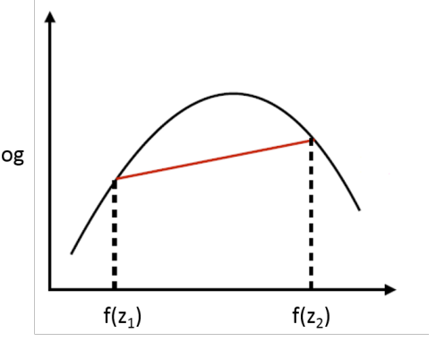
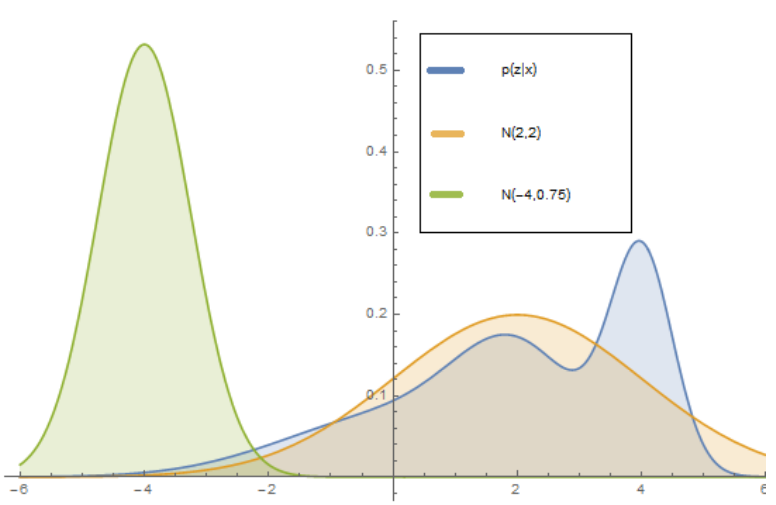
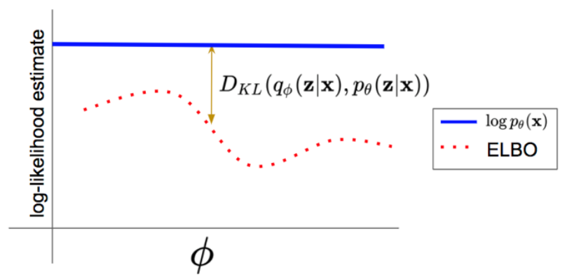
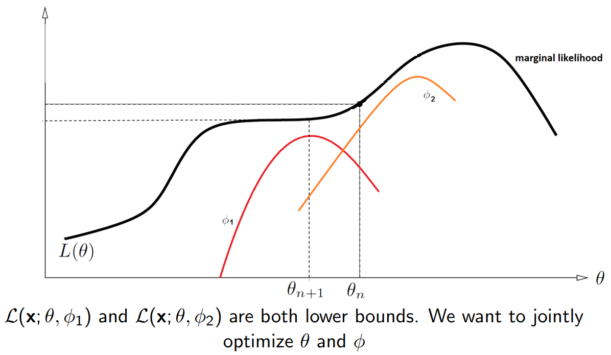
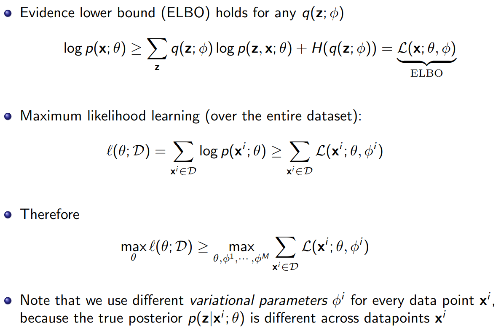
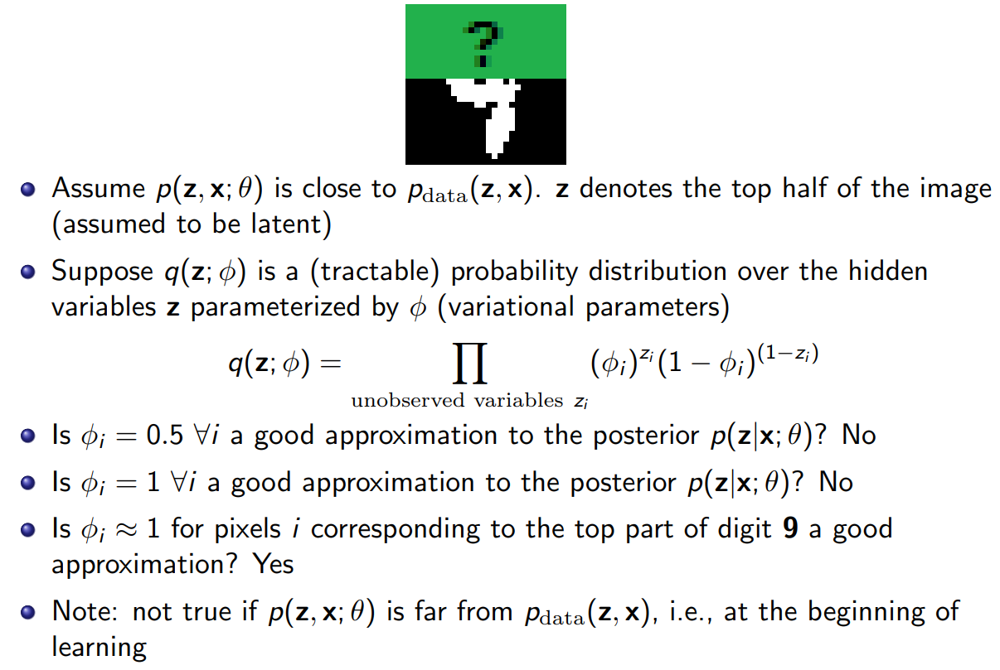
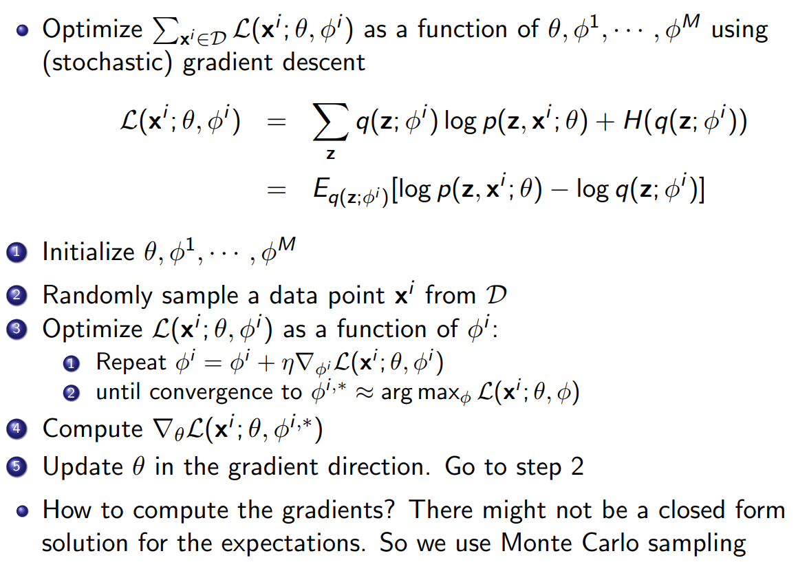
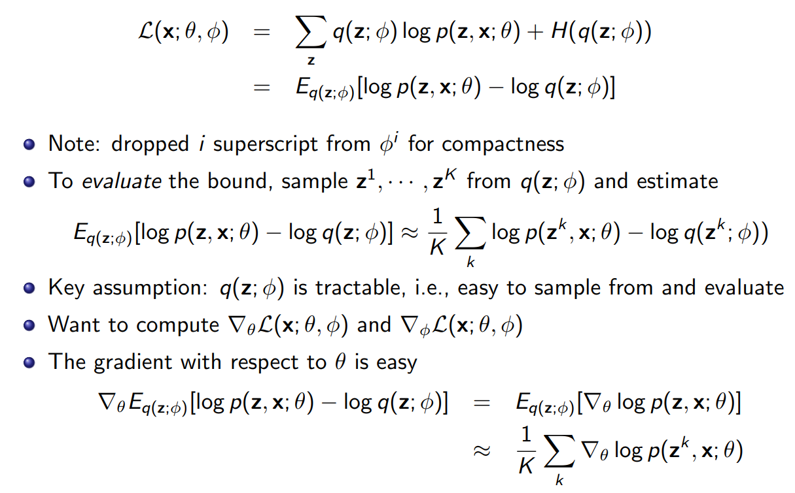

# Latent Variable Models: Motivation

## 现象与挑战

人脸图像 $x$ 的像素差异由许多不可见的因素共同造成：年龄、姿态、头发/眼睛颜色、光照等。如果这些因素都被标注，我们可以按属性做条件建模，难度会大幅降低；但实际数据里往往只有图像，没有这些标签，如何利用这层潜在结构并不显然。

## 核心想法：显式引入潜变量

在模型中加入一组随机变量 $z$ 表示“变化的原因”。生成式观点：先从先验采样 $z\sim p(z)$，再由条件分布生成观测 $x\sim p_\theta(x\mid z)$。直观上，$z$ 是“原因”，$x$ 是“结果”；虽然我们只看到 $x$，但希望通过 $z$ 来解释其多样性。

## 好处与用途

- 更灵活：$z$ 作为全局因子，便于表达多模态与长程变化。
- 可解释/可控：若 $z$ 与语义因素对齐，可在 $z$ 空间做插值或修改，实现属性控制与编辑。
- 更易下游：在 $z$ 上做分类/回归通常比直接在像素上更简单；少量 $z$ 即可概括高维 $x$。

（后续课程会讨论：$p_\theta(x)$ 与 $p_\theta(z\mid x)$ 通常难以解析，需用 EM 或变分推断/ELBO（如 VAE）来学习与推断；另外，自回归建模 $p(x)=\prod_i p(x_i\mid x_{<i})$ 与潜变量方法是互补的，实践中常结合。）

# Latent Variable Models: Motivation

## 建模目标：联合分布 $p(x, z)$

- 我们要建模观测像素 $x$ 与潜变量 $z$ 的联合分布 $p(x, z)$。如上图（左），$x$ 被阴影覆盖表示（它是在数据集中能被观察到的），而 $z$ 未被阴影覆盖表示“未观测/无标签”（这意味着我们没有相应潜在变量的标记）。

- 如上图（右），一张人脸可以用一个简单的图模型（贝叶斯网络）来刻画：我们看到的是像素 $x$，其背后由一组潜在变量 $z$ 来描述这些像素背后的因素与依赖关系。

## 潜变量z的高级特性

- 潜变量 $z$ 可能对应人脸的一些高层特性（例如性别、眼睛颜色、发色、鼻型等）。

- 如果 $z$ 选取得当，那么在给定 $z$ 的条件下建模 $p(x\mid z)$ 通常比直接建模 $p(x)$ 容易得多。

- 当模型训练完成后，可以通过后验分布 $p(z\mid x)$ 来识别样本的属性。例如：$p(\text{EyeColor}=\text{Blue}\mid x)$，表示“给定图像 $x$，该样本眼睛为蓝色”的概率。关于为何成立与如何近似计算，见下文“为什么 $p(z\mid x)$ 能‘识别属性’”。

## 为什么 $p(z\mid x)$ 能“识别属性”

- 生成式假设：先 $z\sim p(z)$，再 $x\sim p_\theta(x\mid z)$。训练好参数后，给定观测 $x$，我们关心其潜在原因的后验：
$$
p_\theta(z\mid x)=\frac{p(z)\,p_\theta(x\mid z)}{\int p(z')\,p_\theta(x\mid z')\,dz'}.
$$

- 若把$z$也看成是一个联合概率$z = (y,w)$，其中眼睛颜色用随机变量 $y$表示，且剩下的其他部分我们用$w$表示如头发颜色、姿态、光照……，则可得到属性概率：
$$
p_\theta(y=\text{Blue}\mid x)=\sum_{w} p_\theta\big(y=\text{Blue},\,w\mid x\big)
$$
- 如果 $w$ 是连续变量，就写成对$w$积分：

$$
p_\theta(y=\text{Blue}\mid x) = \int p_\theta(y=\text{Blue}, w \mid x)\,dw
$$

- 以上公式这就是“给定图像 $x$，眼睛为蓝色”的后验概率。

## 两种常见方式

- 显式属性（结构化潜变量）：令 $y\sim\text{Cat}(\pi)$ 表示眼睛颜色，$w\sim\mathcal N(0,I)$ 表示其他因素，$x\sim p_\theta(x\mid y,w)$。此时 $p_\theta(y\mid x)$（或其近似 $q_\phi(y\mid x)$）就是属性概率。
- 非显式连续潜变量：若未显式拆出 $y$，可在 $z$ 空间遍历或训练轻量探针 $f(z)$ 来识别属性；但纯无监督下语义不一定与某一维对齐，需归纳偏置或少量监督。

## 挑战并引出深入神经网络

- 如果我们想让 $z$ 对应人脸的“眼睛颜色、发色、姿态、光照”等语义特征，那么就需要 **手工设计这些条件分布**，例如：$p(\text{EyeColor} = \text{Blue} \mid x)$，$p(\text{HairColor} = \text{Blonde} \mid x)$等。
- 但是：
  1. 特征之间高度耦合（比如眼睛颜色和人种相关，姿态和光照相关），很难用简单公式写出来。
  2. 数据分布复杂（真实图像的像素分布非常高维），我们几乎不可能手工写一个准确的概率模型。
  3. 如果用规则或条件概率表，维度爆炸，无法管理。

# Deep Latent Variable Models

## 用神经网络建模条件分布

- 深度潜变量模型用神经网络来参数化先验与条件分布，典型设定：
  - 先验：$z\sim\mathcal N(0, I)$。
  - 生成（解码器）：$p_\theta(x\mid z)=\mathcal N\big(\mu_\theta(z),\,\Sigma_\theta(z)\big)$，其中 $\mu_\theta(\cdot),\Sigma_\theta(\cdot)$ 由神经网络输出（对图像常用均值网络+对角方差）。
- 直观理解：$z$ 通过神经网络映射到 $x$ 的分布参数，从而“以 $z$ 为因”生成 $x$。

## 训练后的期望：$z$ 对齐“有意义的因素”

- 希望经过训练，$z$ 能对应到变化因素（features），实现无监督表征学习；也就是说，$z$ 的某些维度或子空间与语义属性有关（如姿态、光照、眼睛颜色等）。
- 实践上是否对齐取决于归纳偏置与训练目标（如ELBO 中的正则、$\beta$-VAE、半监督信号等）。

## 一如既往：通过 $p(z\mid x)$ 获得特征

- 训练好后，仍然能通过后验 $p_\theta(z\mid x)$（或其近似 $q_\phi(z\mid x)$）来计算特征。
- 若含显式属性变量 $y\subset z$，则 $p_\theta(y\mid x)$ 直接给出属性概率；若不显式区分，可在 $z$ 空间做遍历或以 $q_\phi(z\mid x)$ 的均值/样本作为特征输入轻量探针。

# Mixture of Gaussians: a Shallow Latent Variable Model

## 模型定义（贝叶斯网 $z\to x$）

- 潜变量：$z\sim\text{Categorical}(1,\dots,K)$，令先验权重为 $\pi_k=\Pr(z=k)$，且 $\sum_k \pi_k=1$。
- 条件分布：$p(x\mid z=k)=\mathcal N(\mu_k,\Sigma_k)$。
- 联合与边缘：
  $$
  p(x,z=k)=\pi_k\,\mathcal N(x\mid\mu_k,\Sigma_k),\quad
  p(x)=\sum_{k=1}^K \pi_k\,\mathcal N(x\mid\mu_k,\Sigma_k).
  $$
- 后验（软聚类/责任度）：
  $$
  p(z=k\mid x)=\frac{\pi_k\,\mathcal N(x\mid\mu_k,\Sigma_k)}{\sum_{j=1}^K \pi_j\,\mathcal N(x\mid\mu_j,\Sigma_j)}.
  $$

## 生成过程与直觉

1. 先从类别分布挑一个分量 $k\sim\text{Categorical}(\pi)\;(=z)$。
2. 再从对应高斯生成样本 $x\sim\mathcal N(\mu_k,\Sigma_k)$。

直觉：每个高斯对应一个“簇/模式”（图中彩色椭圆），边缘分布 $p(x)$ 是这些高斯的加权混合，适合表示多峰数据。后验 $p(z\mid x)$ 给每个样本属于各簇的软概率。

## 学习与推断要点（EM）

- 极大似然可用 EM 优化。设数据集 $\{x^{(j)}\}_{j=1}^m$，E 步计算“责任度” $\gamma_k^{(j)}=p(z=k\mid x^{(j)})$；M 步更新参数：
  $$
  \pi_k\leftarrow \frac{1}{m}\sum_{j=1}^m \gamma_k^{(j)},\quad
  \mu_k\leftarrow \frac{\sum_j \gamma_k^{(j)} x^{(j)}}{\sum_j \gamma_k^{(j)}},\quad
  \Sigma_k\leftarrow \frac{\sum_j \gamma_k^{(j)}\big(x^{(j)}-\mu_k\big)\big(x^{(j)}-\mu_k\big)^\top}{\sum_j \gamma_k^{(j)}}.
  $$
- 特殊情形：若 $\Sigma_k=\sigma^2 I$ 且 $\pi_k$ 相等，EM 在某些极限下与 $k$-means 的软到硬分配相关联。
 - 聚类解释（对应第二张 PPT）：用后验 $p(z\mid x)$ 识别样本属于哪个混合分量，实现软聚类。
 - 无监督学习注意（ill-posed）：仅从无标签数据学习会面临可辨识性与初始化敏感（如 label switching）；需要良好初始化/正则化/先验来稳定训练与解释。

# Mixture models

## 另一种动机：把简单模型“加起来”变强

- 混合模型的直觉是：将若干个简单的成分分布叠加（加权求和），就能得到更复杂、更有表现力的总体分布。每个成分专注于解释数据的一部分模式，组合后能自然形成多峰形状。

## 公式推导（与 GMM 对齐）

对任意潜变量 $z$ 的混合模型：
$$
p(x)=\sum_{z} p(x,z)=\sum_{z} p(z)\,p(x\mid z).
$$
当 $z\in\{1,\dots,K\}$ 且成分为高斯时（GMM）：
$$
p(x)=\sum_{k=1}^K p(z=k)\,\mathcal N\big(x;\mu_k,\Sigma_k\big),
$$
其中 $p(z=k)=\pi_k,\; \sum_k \pi_k=1$。

## 直觉与联系

- 单个成分（如一个高斯）通常难以拟合多峰数据；若用多个成分，每个成分解释一个局部簇，叠加后即可拟合整体的复杂形状（配图中多条彩色曲线相加得到橙色总体）。
- 与前文 GMM 小节呼应：后验 $p(z\mid x)$ 给出“属于哪个成分”的软概率；学习上常用 EM 最大化似然来估计 $\{\pi_k,\mu_k,\Sigma_k\}$。

# Marginal Likelihood（边缘似然）

## 设定与直观

- 训练时部分像素缺失（如上半部分被遮挡，图中绿色区域）。将观测到的像素记为 $X$，未观测（缺失或真正的潜变量）记为 $Z$。
- 我们拥有联合概率模型 $p_\theta(X, Z)$（例如 PixelCNN/自回归或带潜变量的生成模型）。问题是：给定一个训练样本的可见部分 $\bar x$，其出现的概率是多少？

## 数学定义：对未观测变量边缘化

- 边缘似然就是“把没看到的随机变量求和/积分掉”：
$$
p_\theta(X=\bar x) = \sum_{z} p_\theta(X=\bar x, Z=z) \quad (Z \text{ 离散})
$$
或
$$
p_\theta(X=\bar x) = \int p_\theta(\bar x, z)\,dz \quad (Z \text{ 连续}).
$$
- 直观理解：这相当于枚举“所有可能的补全方式”（把绿色区域全部填完），并把每种补全在模型下的联合概率相加。
- 数据集的极大似然学习即最大化
$$
\mathcal L(\theta) = \sum_{i} \log p_\theta\big(X=\bar x^{(i)}\big) = \sum_i \log \sum_{z} p_\theta(\bar x^{(i)}, z).
$$

## 学习与推理：为何需要 EM/变分

- 直接对 $\log \sum_{z} p_\theta(\bar x, z)$ 求梯度常不易（求和/积分高维且指数多）。常用两类策略：
  - EM：E 步用后验 $p_\theta(z\mid \bar x)$ 计算“期望完备数据对数似然”；M 步对参数 $\theta$ 最大化该期望。
  - 变分推断（如 VAE）：用近似后验 $q_\phi(z\mid \bar x)$ 下界边缘似然：
$$
\log p_\theta(\bar x) \ge \mathbb E_{q_\phi(z\mid\bar x)}[\log p_\theta(\bar x, z) - \log q_\phi(z\mid\bar x)]\;=\;\text{ELBO}.
$$
- 小结：边缘似然通过“对未观测变量边缘化”来度量观测数据的概率；而在计算与优化上，通常借助 EM 或变分下界来进行可行的学习与推断。

# Variational Autoencoder: Marginal Likelihood

## 生成设定：无限高斯混合的视角

- VAE 的基本生成假设：
  1) 先验 $z\sim\mathcal N(0,I)$；
  2) 条件分布 $p_\theta(x\mid z)=\mathcal N\big(\mu_\theta(z),\,\Sigma_\theta(z)\big)$，其中 $\mu_\theta,\Sigma_\theta$ 由神经网络输出。
- 将 $z$ 视为连续“成分索引”，则边缘分布是“无穷多个高斯成分的混合”：
$$
p_\theta(x) 
= \int p(z)\,\mathcal N\big(x\mid\mu_\theta(z),\Sigma_\theta(z)\big)\,dz,
$$
这与有限个分量的 GMM 一致，只是把求和换成了对 $z$ 的积分。

## 边缘似然与后验推理

- 同上一节，观测样本 $\bar x$ 的边缘似然为
$$
p_\theta(\bar x)=\int p_\theta(\bar x, z)\,dz=\int p(z)\,p_\theta(\bar x\mid z)\,dz.
$$
- 精确计算和对 $\theta$ 的直接优化都困难，关键在于难以得到后验 $p_\theta(z\mid \bar x)$ 并对其积分。

# Partially observed data（部分观测数据）

## 问题设定与极大似然目标

- 有联合概率模型 $p(X,Z;\theta)$，数据集为 $\mathcal D=\{x^{(1)},\dots,x^{(M)}\}$；每个样本只观测到 $X$（如像素），$Z$ 从不被观测（如簇/类别/潜在特征）。
- 极大似然学习（离散 $Z$）：
$$
\log \prod_{x\in\mathcal D} p(x;\theta)
= \sum_{x\in\mathcal D} \log p(x;\theta)
= \sum_{x\in\mathcal D} \log \sum_{z} p(x,z;\theta)
$$
- 或（连续 $Z$）：

$$
\sum_{x\in\mathcal D} \log \int p(x,z;\theta)\,dz
$$
- 我们要最大化的目标：
$$
\theta^{*} 
= \operatorname*{arg\,max}_{\theta} \sum_{x\in\mathcal D} \log p(x;\theta)
= \operatorname*{arg\,max}_{\theta} \sum_{x\in\mathcal D} \log \sum_{z} p(x,z;\theta)
$$

## 计算困难的来源

- 对离散 $Z$：若有 30 个二值潜变量 $z\in\{0,1\}^{30}$，则求和含 $2^{30}$ 项，代价指数级；
- 对连续 $Z$：$\log\int p_\theta(x,z)dz$ 的积分通常无解析解，梯度 $\nabla_\theta$ 也难以直接计算。
- 困难点本质是“在对数外的求和/积分”：$\log\sum_z p_\theta(x,z)$ 会耦合所有 $z$ 的可能取值，使得精确梯度与标注级别的推断都不可行。

## 需要近似：便宜且可每样本一评估

- 训练时往往需要对每个样本至少做一次梯度评估，因此近似必须足够便宜。常见做法：
  - EM：用 $p_\theta(z\mid x)$ 的期望替换“缺失的完备数据”，交替优化；
  - 变分推断/ELBO（如 VAE）：用 $q_\phi(z\mid x)$ 构造下界，将“对数外的求和/积分”搬到期望内，转化为可微且可采样的目标；
  - 采样近似：重要性采样、MCMC 等在某些场景可用，但计算代价更高，常作为对比或评估手段。

# First attempt: Naive Monte Carlo（朴素蒙特卡洛）

## 将求和改写为“均匀分布下的期望”

- 对部分可观测数据而言，似然函数 $p_\theta(x)$ 很难计算。可将求和改成成均匀分布下的期望来进行计算，对离散 $\mathcal Z$：
$$
p_\theta(x)
= \sum_{\text{All value of z}} p_\theta(x,z)
= |\mathcal Z|\;\sum_{z\in\mathcal Z} \frac{1}{|\mathcal Z|}\,p_\theta(x,z)
= |\mathcal Z|\;\mathbb E_{z\sim\text{Uniform}(\mathcal Z)}\big[\,p_\theta(x,z)\,\big].
$$
- 思路：把不可解的求和/积分视作期望，用蒙特卡洛样本均值来近似。

## 朴素估计量（均匀采样）

- 从均匀分布中独立抽取 $k$ 个样本 $z^{(1)},\dots,z^{(k)} \sim\text{Uniform}(\mathcal Z)$，构造蒙特卡罗估计量：

$$
\hat\mu_k \;=\; \frac{1}{k}\sum_{j=1}^k p_\theta\big(x, z^{(j)}\big)
$$

- 根据**大数定律**（Strong/Weak Law of Large Numbers），当 $k\to\infty$ 时，样本平均几乎必然/以概率一收敛到真实期望：

$$
\hat\mu_k \xrightarrow{a.s.} \mathbb E_{z\sim\text{Uniform}(\mathcal Z)}[p_\theta(x,z)] \\
\mathbb E_{z\sim\text{Uniform}(\mathcal Z)}[p_\theta(x,z)]\;\approx\;\frac{1}{k}\sum_{j=1}^{k} p_\theta\big(x, z^{(j)}\big)
$$

- 从而可得到：

$$
\sum_{z} p_\theta(x,z) \approx |\mathcal Z|\;\frac{1}{k}\sum_{j=1}^{k} p_\theta\big(x, z^{(j)}\big).
$$

## 为什么实践中行不通（动机：走向重要性采样/变分）

- 对大多数 $z$，$p_\theta(x,z)$ 极小（大多数补全不合理）；少数 $z$ 有较大值，但用均匀采样几乎“打不中”这些高贡献区域，导致方差巨大、估计极不稳定。如上图，蓝线（均匀 MC）前期几乎为零，偶尔“打中”高贡献的$z$会产生巨大跳变，之后又长时间偏离，整体收敛慢且抖动大。
- 解决要点：需要“更聪明的抽样分布”把采样重心放在高贡献区域——这就引出重要性采样（以 $q(z)$ 取代均匀分布并做权重修正），以及进一步的变分推断（学习到依赖于 $x$ 的 $q_\phi(z\mid x)$）。

# Second attempt: Importance Sampling（重要性采样）

- 和“Naive MC”对比：均匀采样很难命中 $p_\theta(x,z)$ 的高贡献区域，导致蓝线抖动大；选择贴近后验的 $q(z)$ 后（橙线），抽样集中在高贡献区域，方差显著下降。

## 重写目标：以任意提议分布 q(z) 的期望表示

- 对离散 $\mathcal Z$（连续情形同理将和换为积分）：
$$
p_\theta(x)
= \sum_{\text{All possible values of } z} p_\theta(x,z)
= \sum_{z\in\mathcal Z} \frac{q(z)}{q(z)}\,p_\theta(x,z)
= \mathbb E_{z\sim q(z)}\Big[\,\frac{p_\theta(x,z)}{q(z)}\,\Big]
$$

## 蒙特卡洛估计量（来自 q 采样）

1) 从 $q(z)$ 抽样：$z^{(1)},\dots,z^{(k)}\sim q(z)$。

2) 用样本平均近似期望：
$$
p_\theta(x) \;\approx\; \frac{1}{k}\sum_{j=1}^k \frac{p_\theta\big(x, z^{(j)}\big)}{q\big(z^{(j)}\big)}
$$
直觉：选一个能“更常命中高贡献区域”的 $q(z)$，方差会显著降低。

## 如何选 q(z) 与无偏性

- 好的 $q(z)$ 应该让采样频繁落在 $p_\theta(x,z)$ 较大的区域（即给定 $x$ 时可能的“补全”）。
- 理想选择是 $q(z)\propto p_\theta(x,z)$ 的归一化形式，即与后验 $p_\theta(z\mid x)$ 接近。
- 上述估计量是无偏的：
$$
\mathbb E_{\{z^{(j)}\}\sim q(z)}\Big[\,\frac{1}{k}\sum_{j=1}^k \frac{p_\theta(x, z^{(j)})}{q(z^{(j)})}\,\Big]
= \mathbb E_{z\sim q(z)}\Big[\,\frac{p_\theta(x, z)}{q(z)}\,\Big]
= p_\theta(x)
$$

# Estimating log-likelihoods（估计对数似然）

## 用重要性采样无偏估计 $p_\theta(x)$

这一小节只关心“如何无偏地估计 $p_\theta(x)$ 本身（不是它的对数）”。上一节我们把难算的边缘似然写成任意提议分布（proposal） $q(z)$ 下的期望：
$$
p_\theta(x)=\sum_{z} p_\theta(x,z)= \mathbb E_{z\sim q(z)}\Big[\underbrace{\frac{p_\theta(x,z)}{q(z)}}_{w(z)\;\text{(重要性权重)}}\Big].
$$

从 $q(z)$ 独立采样 $k$ 次：$z^{(1)},\dots,z^{(k)}\sim q(z)$，并定义权重:
$$
w^{(j)} = \frac{p_\theta\big(x,z^{(j)}\big)}{q\big(z^{(j)}\big)}
$$
则蒙特卡洛估计量为：
$$
\hat p_k(x) = \frac{1}{k}\sum_{j=1}^k w^{(j)}
$$
并满足:
$$
\mathbb E[\hat p_k(x)] = p_\theta(x) \quad (\text{无偏}).
$$

## 但训练需要的是 log p_θ(x)：直接取对数会产生偏差

- 朴素做法：
$$
\log p_\theta(x) \stackrel{?}{\approx} \log\Big(\frac{1}{k}\sum_{j=1}^k \frac{p_\theta(x, z^{(j)})}{q(z^{(j)})}\Big) \;\approx\; \log\Big(\frac{p_\theta(x, z^{(1)})}{q(z^{(1)})}\Big)\quad (k=1)
$$
- 但根据 Jensen 不等式（log 是凹函数）：
$$
\mathbb E\big[\,\log \hat p(x)\,\big] \;\le\; \log\big(\mathbb E[\hat p(x)]\big) \;=\; \log p_\theta(x),
$$
- 即直接对无偏估计取对数会得到“向下有偏”的估计，且方差越大偏差越明显。

## 解决：变分下界（ELBO）作为可优化替代

- 选择 $q_\phi(z\mid x)$，利用
$$
\log p_\theta(x) = \log \int q_\phi(z\mid x)\,\frac{p_\theta(x,z)}{q_\phi(z\mid x)}\,dz 
\;\ge\; \mathbb E_{q_\phi(z\mid x)}\big[\log p_\theta(x\mid z)\big] - \mathrm{KL}\big(q_\phi(z\mid x)\,\|\,p(z)\big),
$$
- 得到可微、低方差的训练目标（ELBO），与前面 VAE 部分自然衔接；当 $q_\phi(z\mid x)$ 接近后验 $p_\theta(z\mid x)$ 时，下界趋紧。
- 本节说明，虽然直接对重要性采样得到的$p_{\theta}$是无偏的，但是训练使用的是$\log p_{\theta}$，直接对齐进行优化会产生向下有偏，从而引出变分下界（ELBO）作为可优化替代。

# Evidence Lower Bound (ELBO) 

## 部分观测数据的计算困难

潜变量模型中，我们只能观测到数据$x$，而潜变量$z$是未观测到的，这导致对数边缘似然 $\log p_\theta(x) $ 包含对未观测变量的求和/积分：$\log p_\theta(x) = \log \sum_z p_\theta(x,z)$ 或 $\log \int p_\theta(x,z)dz$。由于求和/积分在对数外，导致直接计算与梯度估计在高维情况下复杂度指数级增长，训练不可行。

## Jensen 不等式推导证据下界

$\log$是凹函数， $\log(px + (1 − p)x ′ ) ≥ p \log(x) + (1 − p) \log(x ′ )$。

利用对数函数的凹性，通过 Jensen 不等式将"对数外的期望"转化为"对数内的期望"：
$$
\begin{aligned}
\log \Big( \mathbb{E}_{z \sim q(z)}[f(z)] \Big) 
&= \log \Big( \sum_{z} q(z) f(z) \Big) \\
&\ge \sum_{z} q(z) \log f(z) \\
&= \mathbb{E}_{z \sim q(z)}[\log f(z)]
\end{aligned}
$$

令$f(z)$如下：
$$
f(z) = \frac{p_\theta(x,z)}{q(z)}
$$

最后可得到$\text{ELBO}$定义如下：

$$
\begin{aligned}
\log p_\theta(x) 
&= \log \Bigg(\mathbb{E}_{z \sim q(z)}\Bigg[\frac{p_\theta(x,z)}{q(z)}\Bigg]\Bigg) \\
&\ge \mathbb{E}_{z \sim q(z)}\Bigg[\log \frac{p_\theta(x,z)}{q(z)}\Bigg] \\
&= \text{ELBO}
\end{aligned}
$$

# Variational Inference: ELBO的熵分解形式

## ELBO的熵分解表示

假设$q(z)$是隐变量上的任意概率分布，证据下界（ELBO）对于任意$q$都成立：
$$
\begin{aligned}
\log p(x; \theta) 
&\geq \text{ELBO} \\
&= \sum_z q(z) \log \left(\frac{p_\theta(x, z)}{q(z)}\right) \\
&= \underbrace{\sum_z q(z) \log p_\theta(x, z)}_{\text{Loglikelihood as if fully observed}} 
   - \underbrace{\sum_z q(z) \log q(z)}_{\text{Entropy H(q) of q}} \\
&= \sum_z q(z) \log p_\theta(x, z) + H(q)
\end{aligned}
$$

其中$H(q) = -\sum_z q(z) \log q(z)$是分布$q$的熵（Entropy $H(q)$ of $q$）。这种分解清晰地展示了ELBO两个组成部分的作用。

## 最优变分分布与等式条件

当变分分布$q$选择为真实后验$q = p(z|x;\theta)$时，ELBO达到上界，不等式变为等式：
$$
\log p(x;\theta) = \sum_z q(z) \log p(z, x; \theta) + H(q)
$$
此时ELBO精确等于边缘对数似然。这为我们提供了变分推断的目标：寻找最接近真实后验的变分分布。

## 与EM算法的联系

PPT指出这正是EM算法E步的计算内容。在E步中，我们固定参数$\theta$，计算后验分布$p(z|x;\theta)$下的期望完整数据对数似然，这等价于用真实后验作为$q(z)$时的ELBO表达式，体现了变分推断与EM算法的深层联系。

# Why is the Bound Tight: 下界收紧的条件

证据下界（ELBO）对于任意$q$都成立：
$$
\begin{aligned}
\log p(x; \theta) 
&\geq \text{ELBO} \\
&= \sum_z q(z) \log \left(\frac{p_\theta(x, z)}{q(z)}\right) \\
\end{aligned}
$$

## 下界收紧的数学证明

当选择$q(z) = p(z|x;\theta)$时，下界变为等式。通过代入真实后验分布进行推导：
$$
\begin{aligned}
\sum_z p(z|x;\theta) \log \frac{p(x,z;\theta)}{p(z|x;\theta)} &= \sum_z p(z|x;\theta) \log \frac{p(z|x;\theta)p(x;\theta)}{p(z|x;\theta)} \\
&= \sum_z p(z|x;\theta) \log p(x;\theta) \\
&= \log p(x;\theta) \underbrace{\sum_z p(z|x;\theta)}_{= 1} \\
&= \log p(x;\theta)
\end{aligned}
$$
最后一步利用了$\sum_z p(z|x;\theta) = 1$，证明了当$q(z)$等于真实后验时，ELBO精确等于边缘对数似然。

## 重要性采样的直觉验证

这一结果证实了之前重要性采样的直觉：我们应该选择"可能的补全"（likely completions）作为采样分布。当$q(z)$越接近真实后验$p(z|x;\theta)$时，采样效率越高，下界越紧。

## 实际应用中的挑战

PPT提出关键问题：如果真实后验$p(z|x;\theta)$难以计算怎么办？下界会有多松？这引出了变分推断的核心任务——寻找易于计算且尽可能接近真实后验的近似分布$q_\phi(z|x)$，在计算可行性和下界紧致性之间取得平衡。

# Variational Inference Continued: KL散度的视角

## KL散度揭示ELBO的本质

从关键恒等式出发，通过代数变换揭示ELBO与KL散度的关系更为直观：**从恒等式开始推导**：我们知道一般情况下有精确关系：

$$
\log p(x;\theta) = \text{ELBO} + D_{KL}(q(z)\|p(z|x;\theta))
$$

现在来验证这个恒等式。首先展开KL散度的定义：
$$
\begin{aligned}
D_{KL}(q(z)\|p(z|x;\theta)) &= \sum_z q(z) \log \frac{q(z)}{p(z|x;\theta)} \\
&= \sum_z q(z) \log q(z) - \sum_z q(z) \log p(z|x;\theta) \\
&= -H(q) - \sum_z q(z) \log p(z|x;\theta)
\end{aligned}
$$

利用贝叶斯定理 $p(z|x;\theta) = \frac{p(z,x;\theta)}{p(x;\theta)}$：
$$
\begin{aligned}
D_{KL}(q(z)\|p(z|x;\theta)) &= -H(q) - \sum_z q(z) \log \frac{p(z,x;\theta)}{p(x;\theta)} \\
&= -H(q) - \sum_z q(z) \log p(z,x;\theta) + \log p(x;\theta) \\
&= \log p(x;\theta) - \underbrace{\left[\sum_z q(z) \log p(z,x;\theta) + H(q)\right]}_{\text{ELBO}}
\end{aligned}
$$

因此：$\log p(x;\theta) = \text{ELBO} + D_{KL}(q(z)\|p(z|x;\theta))$

由于$D_{KL} \geq 0$，立即得到：$\log p(x;\theta) \geq \text{ELBO}$

## 等式成立的KL散度条件

当$q = p(z|x;\theta)$时，等式成立，因为此时$D_{KL}(q(z)\|p(z|x;\theta)) = 0$：
$$
\log p(x;\theta) = \sum_z q(z) \log p(z,x;\theta) + H(q)
$$
这从KL散度的角度再次证实了为什么选择真实后验作为变分分布时下界变紧。

## ELBO与KL散度的一般关系

一般情况下，有精确关系：$\log p(x;\theta) = \text{ELBO} + D_{KL}(q(z)\|p(z|x;\theta))$。$q(z)$越接近$p(z|x;\theta)$，KL散度越小，ELBO越接近真实对数似然。这为变分推断提供了清晰的优化目标：**寻找使KL散度最小的近似后验分布**。

# Intractable Posteriors: 变分推断的实际挑战

## 后验计算困难与变分近似的引入

当真实后验$p(z|x;\theta)$难以计算时（在变分自编码器（VAE）中，这相当于对定义了$p(x|z) = \mathcal{N}(\mu_\theta(z), \Sigma_\theta(z))$的神经网络 $\mu_\theta, \Sigma_\theta$ 做一次“反演inverting”）。

变分推断的解决方案是：假设$q(z;\phi)$是隐变量上由变分参数$\phi$参数化的（可处理的）概率分布。例如，选择均值和协方差由$\phi$指定的高斯分布：
$$
q(z;\phi) = \mathcal{N}(\phi_1, \phi_2)
$$

这样我们用一个简单的参数化分布族来近似复杂的真实后验分布。

## 变分推断的优化目标

变分推断的目标是选择参数$\phi$，使得$q(z;\phi)$尽可能接近真实后验$p(z|x;\theta)$。通过最小化KL散度等价于最大化ELBO：
$$
\phi^* = \arg\min_\phi D_{KL}(q(z;\phi)\|p(z|x;\theta)) = \arg\max_\phi \text{ELBO}
$$
这将原本难以处理的后验推断问题转化为可优化的参数学习问题。

## 近似质量的可视化理解

PPT中的图示清晰展示了不同参数选择对近似质量的影响：真实后验$p(z|x)$（蓝色）被$\mathcal{N}(2,2)$（橙色）比$\mathcal{N}(-4,0.75)$（绿色）更好地近似。这说明变分分布的参数选择直接影响ELBO的紧致程度，好的近似能够显著提升模型性能。

# The Evidence Lower Bound: 联合优化框架

## ELBO的完整数学表达

PPT给出了变分推断中ELBO的完整表达形式，包含变分参数$\phi$：
$$
\log p(x;\theta) \geq \sum_z q(z;\phi) \log p(z,x;\theta) + H(q(z;\phi)) = \underbrace{\mathcal{L}(x;\theta,\phi)}_{\text{ELBO}}
$$
同时给出了精确的恒等关系：
$$
\log p(x;\theta) = \mathcal{L}(x;\theta,\phi) + D_{KL}(q(z;\phi)\|p(z|x;\theta))
$$
这清晰展示了对数似然、ELBO（记为$\mathcal{L}$）和KL散度之间的数学关系。

## 近似质量与KL散度的可视化关系

PPT中的图形直观展示了关键概念：蓝色水平线表示固定的$\log p_\theta(x)$，红色虚线表示随变分参数$\phi$变化的ELBO。两者之间的垂直距离正是KL散度$D_{KL}(q_\phi(z|x), p_\theta(z|x))$。当$q(z;\phi)$能更好地近似真实后验$p(z|x;\theta)$时，KL散度变小，ELBO更接近真实对数似然。

## 联合优化策略

变分推断的核心是在数据集上联合优化模型参数$\theta$和变分参数$\phi$来最大化ELBO。这比传统的EM算法更灵活，因为我们不需要精确计算后验分布，而是通过优化一个参数化的近似分布来同时学习模型和进行推断，为深度生成模型（如VAE）提供了可行的训练框架。

# Variational Learning: 交替优化的可视化理解

## 下界函数的几何理解

PPT中的图形清晰展示了变分学习的核心思想：黑色曲线表示真实的边缘对数似然函数$\tilde{L}(\theta)$，这是我们最终想优化的目标函数（最大似然学习）。但它通常 **难以直接计算**，因为需要对潜变量 $z$ 积分。

红色和橙色曲线分别表示不同变分参数下的ELBO函数$\mathcal{L}(x;\theta,\phi_1)$和$\mathcal{L}(x;\theta,\phi_2)$。这些ELBO都是真实对数似然的下界，不同的$\phi$值产生不同的下界函数形状。如：

- 红色曲线($\phi_1$)：给出的下界比较松，没能紧贴黑色曲线（真实边缘似然）
- 橙色曲线($\phi_2$)：给出的下界更紧，更好地逼近黑色曲线

**$\theta_n, \theta_{n+1}$：**
 表示在训练过程中，随着 $\theta$ 的更新，我们在“边际似然”和“下界”之间不断交替优化，逐步逼近最优解。

## 交替优化的迭代过程

**交替优化过程**：
在当前参数$\theta_n$处，首先固定$\theta$优化变分参数$\phi$（如从$\phi_1$优化到$\phi_2$），使ELBO在该点处更紧地逼近真实似然；然后固定优化后的$\phi_2$，沿着当前下界函数的梯度方向更新模型参数$\theta$（从$\theta_n$到$\theta_{n+1}$）。

**关键洞察**：我们并非直接优化不可计算的边缘似然，而是通过不断改善变分近似质量和更新模型参数的交替过程，在可计算的下界上进行优化，从而间接逼近最优解。

## 联合优化的实际意义

PPT强调$\mathcal{L}(x;\theta,\phi_1)$和$\mathcal{L}(x;\theta,\phi_2)$都是下界，我们希望联合优化$\theta$和$\phi$。这种方法的优势在于：通过不断改善变分近似质量（收紧下界）和更新模型参数，能够在理论保证下逐步接近真实的最大似然解，为深度潜变量模型提供了可行且高效的训练算法。

# ELBO Applied to Entire Dataset: 数据集级优化

## 从单样本到整个数据集的扩展

ELBO不等式对任意变分分布$q(z;\phi)$都成立：
$$
\log p(x;\theta) \geq \sum_z q(z;\phi) \log p(z,x;\theta) + H(q(z;\phi)) = \underbrace{\mathcal{L}(x;\theta,\phi)}_{\text{ELBO}}
$$
扩展至整个数据集$\mathcal{D}$，最大似然学习变为：
$$
\ell(\theta;\mathcal{D}) = \sum_{x^i \in \mathcal{D}} \log p(x^i;\theta) \geq \sum_{x^i \in \mathcal{D}} \mathcal{L}(x^i;\theta,\phi^i)
$$

## 数据集级变分优化的理论保证

基于单样本ELBO的有效性，可以得出数据集级的优化不等式：
$$
\max_\theta \ell(\theta;\mathcal{D}) \geq \max_{\theta,\phi^1,\ldots,\phi^M} \sum_{x^i \in \mathcal{D}} \mathcal{L}(x^i;\theta,\phi^i)
$$
这表明最大化所有样本ELBO之和的下界，能够为真实的最大似然提供理论保证的近似解。

## 每个数据点独立变分参数的必要性

PPT强调对每个数据点$x^i$使用不同的变分参数$\phi^i$，因为真实后验$p(z|x^i;\theta)$在不同数据点间是不同的。这种设计允许变分分布针对每个样本的特定后验进行个性化近似，避免了用单一变分分布强行拟合所有样本后验的不当做法，为VAE等深度生成模型的有效训练奠定了理论基础。

## 为什么需要单样本级别的变分参数？

**理论原因**：每个观测$x^i$对应不同的真实后验分布$p(z|x^i;\theta)$。如果我们只用一个全局的$\phi$来近似所有样本的后验，就相当于假设所有样本背后的潜变量分布都相同，这显然是不合理的。

**直观例子**：
- 样本$x^1$（一张猫的图片）：其后验$p(z|x^1;\theta)$可能集中在"动物=猫"的潜变量区域
- 样本$x^2$（一张狗的图片）：其后验$p(z|x^2;\theta)$可能集中在"动物=狗"的潜变量区域

如果用同一个$\phi$近似这两个截然不同的后验分布，必然导致近似质量严重下降。

**数学后果**：使用全局$\phi$会导致：
$$
\sum_{x^i \in \mathcal{D}} D_{KL}(q(z;\phi)\|p(z|x^i;\theta))
$$
变得很大，使得ELBO变松，优化效果差。

而使用个性化的$\phi^i$可以让每个KL散度项都尽可能小，从而获得更紧的下界和更好的学习效果。

# A Variational Approximation to the Posterior: 具体示例

本节用一个具体的例子来说明**为什么需要单样本级别的变分参数**

## 图像补全任务的变分设定

假设$p(z,x;\theta)$接近真实数据分布$p_{data}(z,x)$，其中$z$表示图像的上半部分（被假定为潜变量）。对于可处理的变分分布$q(z;\phi)$，给出了具体的伯努利分布形式：
$$
q(z;\phi) = \prod_{\text{unobserved variables } z_i} (\phi_i)^{z_i}(1-\phi_i)^{(1-z_i)}
$$
这里每个未观测像素$z_i$都由独立的伯努利分布建模，参数为$\phi_i$。

## 变分参数选择的直观分析

通过具体问题展示了变分参数选择的重要性($\forall$ 这个符号表示for all)：
- $\phi_i = 0.5 \; \forall i$（所有像素概率0.5）：这等于随机猜测，显然不是好的后验近似
- $\phi_i = 1 \; \forall i$（所有像素为1）：这忽略了观测到的下半部分信息，同样不合理
- $\phi_i \approx 1$（仅对数字"9"上半部分对应的像素）：这是好的近似，因为它利用了观测信息来推断未观测部分

## 模型质量对近似效果的影响

最后强调了一个重要注意事项：当$p(z,x;\theta)$与真实分布$p_{data}(z,x)$相差很大时（如在学习初期），即使是理论上最优的变分近似也可能效果不佳。这说明变分推断的成功不仅依赖于近似分布的选择，更依赖于生成模型本身的质量。

# Learning via Stochastic Variational Inference (SVI): 实用算法

## ELBO的期望形式与优化目标

SVI算法优化数据集上所有样本的ELBO之和：$\sum_{x^i \in \mathcal{D}} \mathcal{L}(x^i;\theta,\phi^i)$，其中单样本ELBO具有期望形式：
$$
\begin{aligned}
\mathcal{L}(x^i;\theta,\phi^i) &= \sum_z q(z;\phi^i) \log p(z,x^i;\theta) + H(q(z;\phi^i)) \\
&= E_{q(z;\phi^i)}[\log p(z,x^i;\theta) - \log q(z;\phi^i)]
\end{aligned}
$$
这种期望形式为随机梯度下降提供了理论基础。

## 交替优化的具体算法流程

SVI采用五步迭代过程：1) 初始化参数$\theta, \phi^1, \ldots, \phi^M$；2) 随机采样数据点$x^i$；3) 固定$\theta$，优化该样本的变分参数$\phi^i$：
$$
\phi^i = \phi^i + \eta \nabla_{\phi^i} \mathcal{L}(x^i;\theta,\phi^i)
$$
直到收敛至$\phi^{i,*} \approx \arg\max_\phi \mathcal{L}(x^i;\theta,\phi)$；4) 计算模型参数梯度$\nabla_\theta \mathcal{L}(x^i;\theta,\phi^{i,*})$；5) 沿着梯度方向更新$\theta$并返回步骤2。

## 梯度计算的蒙特卡洛方法

PPT指出梯度计算的关键挑战：期望$E_{q(z;\phi^i)}[\cdot]$可能没有解析解。解决方案是使用蒙特卡洛采样：从$q(z;\phi^i)$中采样$z$的样本，用样本均值近似期望，从而估计梯度。这使得SVI能够处理复杂的变分分布和生成模型。

## SVI的实际价值与局限

SVI的优势在于将理论上的变分推断转化为可实施的随机优化算法，特别适合大规模数据集。然而其成功依赖于有效的梯度估计和合适的变分分布选择。这种框架为后续的深度变分模型（如VAE）奠定了算法基础。

# Learning Deep Generative Models: 梯度计算详解

## ELBO的蒙特卡洛估计

深度生成模型中，ELBO具有期望形式（为简洁省略上标$i$）：
$$
\begin{aligned}
\mathcal{L}(x;\theta,\phi) &= \sum_z q(z;\phi) \log p(z,x;\theta) + H(q(z;\phi)) \\
&= E_{q(z;\phi)}[\log p(z,x;\theta) - \log q(z;\phi)]
\end{aligned}
$$
为评估此下界，从$q(z;\phi)$中采样$z^1, \ldots, z^K$，并用蒙特卡洛估计：
$$
E_{q(z;\phi)}[\log p(z,x;\theta) - \log q(z;\phi)] \approx \frac{1}{K} \sum_k (\log p(z^k,x;\theta) - \log q(z^k;\phi))
$$

## 关于θ的梯度计算

关于模型参数$\theta$的梯度相对简单，因为期望不依赖于$\theta$：
$$
\begin{aligned}
\nabla_\theta E_{q(z;\phi)}[\log p(z,x;\theta) - \log q(z;\phi)] &= E_{q(z;\phi)}[\nabla_\theta \log p(z,x;\theta)] \\
&\approx \frac{1}{K} \sum_k \nabla_\theta \log p(z^k,x;\theta)
\end{aligned}
$$
这里可以直接交换梯度与期望的顺序，使得计算变得直接。

## 关于$\phi$的梯度计算挑战

关于变分参数$\phi$的梯度更加复杂，因为期望本身依赖于$\phi$。PPT指出这需要用蒙特卡洛方法估计，但直接的蒙特卡洛方法会遇到高方差问题。课程后续将介绍REINFORCE等强化学习技术来解决这个问题。

## 连续潜变量的特殊技巧

PPT最后提到，对于连续$z$和某些特定分布，存在更好但通用性稍差的替代方法。这暗示了重参数化技巧等高级方法，它们能够有效降低梯度估计的方差，为深度变分模型（如VAE）的成功训练提供了关键技术支撑。