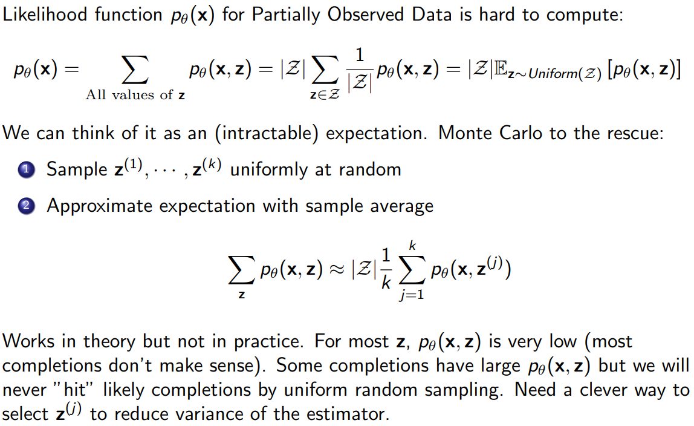

# Latent Variable Models: Motivation

## 现象与挑战

人脸图像 $x$ 的像素差异由许多不可见的因素共同造成：年龄、姿态、头发/眼睛颜色、光照等。如果这些因素都被标注，我们可以按属性做条件建模，难度会大幅降低；但实际数据里往往只有图像，没有这些标签，如何利用这层潜在结构并不显然。

## 核心想法：显式引入潜变量

在模型中加入一组随机变量 $z$ 表示“变化的原因”。生成式观点：先从先验采样 $z\sim p(z)$，再由条件分布生成观测 $x\sim p_\theta(x\mid z)$。直观上，$z$ 是“原因”，$x$ 是“结果”；虽然我们只看到 $x$，但希望通过 $z$ 来解释其多样性。

## 好处与用途

- 更灵活：$z$ 作为全局因子，便于表达多模态与长程变化。
- 可解释/可控：若 $z$ 与语义因素对齐，可在 $z$ 空间做插值或修改，实现属性控制与编辑。
- 更易下游：在 $z$ 上做分类/回归通常比直接在像素上更简单；少量 $z$ 即可概括高维 $x$。

（后续课程会讨论：$p_\theta(x)$ 与 $p_\theta(z\mid x)$ 通常难以解析，需用 EM 或变分推断/ELBO（如 VAE）来学习与推断；另外，自回归建模 $p(x)=\prod_i p(x_i\mid x_{<i})$ 与潜变量方法是互补的，实践中常结合。）

# Latent Variable Models: Motivation

## 建模目标：联合分布 $p(x, z)$

- 我们要建模观测像素 $x$ 与潜变量 $z$ 的联合分布 $p(x, z)$。如上图（左），$x$ 被阴影覆盖表示（它是在数据集中能被观察到的），而 $z$ 未被阴影覆盖表示“未观测/无标签”（这意味着我们没有相应潜在变量的标记）。

- 如上图（右），一张人脸可以用一个简单的图模型（贝叶斯网络）来刻画：我们看到的是像素 $x$，其背后由一组潜在变量 $z$ 来描述这些像素背后的因素与依赖关系。

## 潜变量z的高级特性

- 潜变量 $z$ 可能对应人脸的一些高层特性（例如性别、眼睛颜色、发色、鼻型等）。

- 如果 $z$ 选取得当，那么在给定 $z$ 的条件下建模 $p(x\mid z)$ 通常比直接建模 $p(x)$ 容易得多。

- 当模型训练完成后，可以通过后验分布 $p(z\mid x)$ 来识别样本的属性。例如：$p(\text{EyeColor}=\text{Blue}\mid x)$，表示“给定图像 $x$，该样本眼睛为蓝色”的概率。关于为何成立与如何近似计算，见下文“为什么 $p(z\mid x)$ 能‘识别属性’”。

## 为什么 $p(z\mid x)$ 能“识别属性”

- 生成式假设：先 $z\sim p(z)$，再 $x\sim p_\theta(x\mid z)$。训练好参数后，给定观测 $x$，我们关心其潜在原因的后验：
$$
p_\theta(z\mid x)=\frac{p(z)\,p_\theta(x\mid z)}{\int p(z')\,p_\theta(x\mid z')\,dz'}.
$$

- 若把$z$也看成是一个联合概率$z = (y,w)$，其中眼睛颜色用随机变量 $y$表示，且剩下的其他部分我们用$u$表示如头发颜色、姿态、光照……，则可得到属性概率：
$$
p_\theta(y=\text{Blue}\mid x)=\sum_{w} p_\theta\big(y=\text{Blue},\,w\mid x\big)
$$
- 如果 $w$ 是连续变量，就写成积分：

$$
p_\theta(y=\text{Blue}\mid x) = \int p_\theta(y=\text{Blue}, w \mid x)\,dw.
$$

- 以上公式这就是“给定图像 $x$，眼睛为蓝色”的后验概率。

## 两种常见方式

- 显式属性（结构化潜变量）：令 $y\sim\text{Cat}(\pi)$ 表示眼睛颜色，$w\sim\mathcal N(0,I)$ 表示其他因素，$x\sim p_\theta(x\mid y,w)$。此时 $p_\theta(y\mid x)$（或其近似 $q_\phi(y\mid x)$）就是属性概率。
- 非显式连续潜变量：若未显式拆出 $y$，可在 $z$ 空间遍历或训练轻量探针 $f(z)$ 来识别属性；但纯无监督下语义不一定与某一维对齐，需归纳偏置或少量监督。

## 挑战

- 如果我们想让 $z$ 对应人脸的“眼睛颜色、发色、姿态、光照”等语义特征，那么就需要 **手工设计这些条件分布**，例如：$p(\text{EyeColor} = \text{Blue} \mid x)$，$p(\text{HairColor} = \text{Blonde} \mid x)$等。
- 但是：
  1. 特征之间高度耦合（比如眼睛颜色和人种相关，姿态和光照相关），很难用简单公式写出来。
  2. 数据分布复杂（真实图像的像素分布非常高维），我们几乎不可能手工写一个准确的概率模型。
  3. 如果用规则或条件概率表，维度爆炸，无法管理。

# Deep Latent Variable Models

## 用神经网络建模条件分布

- 深度潜变量模型用神经网络来参数化先验与条件分布，典型设定：
  - 先验：$z\sim\mathcal N(0, I)$。
  - 生成（解码器）：$p_\theta(x\mid z)=\mathcal N\big(\mu_\theta(z),\,\Sigma_\theta(z)\big)$，其中 $\mu_\theta(\cdot),\Sigma_\theta(\cdot)$ 由神经网络输出（对图像常用均值网络+对角方差）。
- 直观理解：$z$ 通过神经网络映射到 $x$ 的分布参数，从而“以 $z$ 为因”生成 $x$。

## 训练后的期望：$z$ 对齐“有意义的因素”

- 希望经过训练，$z$ 能对应到变化因素（features），实现无监督表征学习；也就是说，$z$ 的某些维度或子空间与语义属性有关（如姿态、光照、眼睛颜色等）。
- 实践上是否对齐取决于归纳偏置与训练目标（如 ELBO 中的正则、$\beta$-VAE、半监督信号等）。

## 一如既往：通过 $p(z\mid x)$ 获得特征

- 训练好后，仍然通过后验 $p_\theta(z\mid x)$（或其近似 $q_\phi(z\mid x)$）来计算特征。
- 若含显式属性变量 $y\subset z$，则 $p_\theta(y\mid x)$ 直接给出属性概率；若不显式区分，可在 $z$ 空间做遍历或以 $q_\phi(z\mid x)$ 的均值/样本作为特征输入轻量探针。

# Mixture of Gaussians: a Shallow Latent Variable Model

## 模型定义（贝叶斯网 $z\to x$）

- 潜变量：$z\sim\text{Categorical}(1,\dots,K)$，令先验权重为 $\pi_k=\Pr(z=k)$，且 $\sum_k \pi_k=1$。
- 条件分布：$p(x\mid z=k)=\mathcal N(\mu_k,\Sigma_k)$。
- 联合与边缘：
  $$
  p(x,z=k)=\pi_k\,\mathcal N(x\mid\mu_k,\Sigma_k),\quad
  p(x)=\sum_{k=1}^K \pi_k\,\mathcal N(x\mid\mu_k,\Sigma_k).
  $$
- 后验（软聚类/责任度）：
  $$
  p(z=k\mid x)=\frac{\pi_k\,\mathcal N(x\mid\mu_k,\Sigma_k)}{\sum_{j=1}^K \pi_j\,\mathcal N(x\mid\mu_j,\Sigma_j)}.
  $$

## 生成过程与直觉

1. 先从类别分布挑一个分量 $k\sim\text{Categorical}(\pi)\;(=z)$。
2. 再从对应高斯生成样本 $x\sim\mathcal N(\mu_k,\Sigma_k)$。

直觉：每个高斯对应一个“簇/模式”（图中彩色椭圆），边缘分布 $p(x)$ 是这些高斯的加权混合，适合表示多峰数据。后验 $p(z\mid x)$ 给每个样本属于各簇的软概率。

## 学习与推断要点（EM）

- 极大似然可用 EM 优化。设数据集 $\{x^{(j)}\}_{j=1}^m$，E 步计算“责任度” $\gamma_k^{(j)}=p(z=k\mid x^{(j)})$；M 步更新参数：
  $$
  \pi_k\leftarrow \frac{1}{m}\sum_{j=1}^m \gamma_k^{(j)},\quad
  \mu_k\leftarrow \frac{\sum_j \gamma_k^{(j)} x^{(j)}}{\sum_j \gamma_k^{(j)}},\quad
  \Sigma_k\leftarrow \frac{\sum_j \gamma_k^{(j)}\big(x^{(j)}-\mu_k\big)\big(x^{(j)}-\mu_k\big)^\top}{\sum_j \gamma_k^{(j)}}.
  $$
- 特殊情形：若 $\Sigma_k=\sigma^2 I$ 且 $\pi_k$ 相等，EM 在某些极限下与 $k$-means 的软到硬分配相关联。
 - 聚类解释（对应第二张 PPT）：用后验 $p(z\mid x)$ 识别样本属于哪个混合分量，实现软聚类。
 - 无监督学习注意（ill-posed）：仅从无标签数据学习会面临可辨识性与初始化敏感（如 label switching）；需要良好初始化/正则化/先验来稳定训练与解释。

# Mixture models

## 另一种动机：把简单模型“加起来”变强

- 混合模型的直觉是：将若干个简单的成分分布叠加（加权求和），就能得到更复杂、更有表现力的总体分布。每个成分专注于解释数据的一部分模式，组合后能自然形成多峰形状。

## 公式推导（与 GMM 对齐）

对任意潜变量 $z$ 的混合模型：
$$
p(x)=\sum_{z} p(x,z)=\sum_{z} p(z)\,p(x\mid z).
$$
当 $z\in\{1,\dots,K\}$ 且成分为高斯时（GMM）：
$$
p(x)=\sum_{k=1}^K p(z=k)\,\mathcal N\big(x;\mu_k,\Sigma_k\big),
$$
其中 $p(z=k)=\pi_k,\; \sum_k \pi_k=1$。

## 直觉与联系

- 单个成分（如一个高斯）通常难以拟合多峰数据；若用多个成分，每个成分解释一个局部簇，叠加后即可拟合整体的复杂形状（配图中多条彩色曲线相加得到橙色总体）。
- 与前文 GMM 小节呼应：后验 $p(z\mid x)$ 给出“属于哪个成分”的软概率；学习上常用 EM 最大化似然来估计 $\{\pi_k,\mu_k,\Sigma_k\}$。

# Marginal Likelihood（边缘似然）

## 设定与直观

- 训练时部分像素缺失（如上半部分被遮挡，图中绿色区域）。将观测到的像素记为 $X$，未观测（缺失或真正的潜变量）记为 $Z$。
- 我们拥有联合概率模型 $p_\theta(X, Z)$（例如 PixelCNN/自回归或带潜变量的生成模型）。问题是：给定一个训练样本的可见部分 $\bar x$，其出现的概率是多少？

## 数学定义：对未观测变量边缘化

- 边缘似然就是“把没看到的随机变量求和/积分掉”：
$$
p_\theta(X=\bar x) = \sum_{z} p_\theta(X=\bar x, Z=z) \quad (Z \text{ 离散})
$$
或
$$
p_\theta(X=\bar x) = \int p_\theta(\bar x, z)\,dz \quad (Z \text{ 连续}).
$$
- 直观理解：这相当于枚举“所有可能的补全方式”（把绿色区域全部填完），并把每种补全在模型下的联合概率相加。
- 数据集的极大似然学习即最大化
$$
\mathcal L(\theta) = \sum_{i} \log p_\theta\big(X=\bar x^{(i)}\big) = \sum_i \log \sum_{z} p_\theta(\bar x^{(i)}, z).
$$

## 学习与推断：为何需要 EM/变分

- 直接对 $\log \sum_{z} p_\theta(\bar x, z)$ 求梯度常不易（求和/积分高维且指数多）。常用两类策略：
  - EM：E 步用后验 $p_\theta(z\mid \bar x)$ 计算“期望完备数据对数似然”；M 步对参数 $\theta$ 最大化该期望。
  - 变分推断（如 VAE）：用近似后验 $q_\phi(z\mid \bar x)$ 下界边缘似然：
$$
\log p_\theta(\bar x) \ge \mathbb E_{q_\phi(z\mid\bar x)}[\log p_\theta(\bar x, z) - \log q_\phi(z\mid\bar x)]\;=\;\text{ELBO}.
$$
- 小结：边缘似然通过“对未观测变量边缘化”来度量观测数据的概率；而在计算与优化上，通常借助 EM 或变分下界来进行可行的学习与推断。

# Variational Autoencoder: Marginal Likelihood

## 生成设定：无限高斯混合的视角

- VAE 的基本生成假设：
  1) 先验 $z\sim\mathcal N(0,I)$；
  2) 条件分布 $p_\theta(x\mid z)=\mathcal N\big(\mu_\theta(z),\,\Sigma_\theta(z)\big)$，其中 $\mu_\theta,\Sigma_\theta$ 由神经网络输出。
- 将 $z$ 视为连续“成分索引”，则边缘分布是“无穷多个高斯成分的混合”：
$$
p_\theta(x) 
= \int p(z)\,\mathcal N\big(x\mid\mu_\theta(z),\Sigma_\theta(z)\big)\,dz,
$$
这与有限个分量的 GMM 一致，只是把求和换成了对 $z$ 的积分。

## 边缘似然与后验推断

- 同上一节，观测样本 $\bar x$ 的边缘似然为
$$
p_\theta(\bar x)=\int p_\theta(\bar x, z)\,dz=\int p(z)\,p_\theta(\bar x\mid z)\,dz.
$$
- 精确计算和对 $\theta$ 的直接优化都困难，关键在于难以得到后验 $p_\theta(z\mid \bar x)$ 并对其积分。

# Partially observed data（部分观测数据）

## 问题设定与极大似然目标

- 有联合概率模型 $p(X,Z;\theta)$，数据集为 $\mathcal D=\{x^{(1)},\dots,x^{(M)}\}$；每个样本只观测到 $X$（如像素），$Z$ 从不被观测（如簇/类别/潜在特征）。
- 极大似然学习（离散 $Z$）：
$$
\log \prod_{x\in\mathcal D} p(x;\theta)
= \sum_{x\in\mathcal D} \log p(x;\theta)
= \sum_{x\in\mathcal D} \log \sum_{z} p(x,z;\theta)
$$
- 或（连续 $Z$）：

$$
\sum_{x\in\mathcal D} \log \int p(x,z;\theta)\,dz
$$
- 我们要最大化的目标：
$$
\theta^{*} 
= \operatorname*{arg\,max}_{\theta} \sum_{x\in\mathcal D} \log p(x;\theta)
= \operatorname*{arg\,max}_{\theta} \sum_{x\in\mathcal D} \log \sum_{z} p(x,z;\theta)
$$

## 计算困难的来源

- 对离散 $Z$：若有 30 个二值潜变量 $z\in\{0,1\}^{30}$，则求和含 $2^{30}$ 项，代价指数级；
  对连续 $Z$：$\log\int p_\theta(x,z)dz$ 的积分通常无解析解，梯度 $\nabla_\theta$ 也难以直接计算。
- 困难点本质是“在对数外的求和/积分”：$\log\sum_z p_\theta(x,z)$ 会耦合所有 $z$ 的可能取值，使得精确梯度与标注级别的推断都不可行。

## 需要近似：便宜且可每样本一评估

- 训练时往往需要对每个样本至少做一次梯度评估，因此近似必须足够便宜。常见做法：
  - EM：用 $p_\theta(z\mid x)$ 的期望替换“缺失的完备数据”，交替优化；
  - 变分推断/ELBO（如 VAE）：用 $q_\phi(z\mid x)$ 构造下界，将“对数外的求和/积分”搬到期望内，转化为可微且可采样的目标；
  - 采样近似：重要性采样、MCMC 等在某些场景可用，但计算代价更高，常作为对比或评估手段。

# First attempt: Naive Monte Carlo（朴素蒙特卡洛）

## 将求和改写为“均匀分布下的期望”

- 对部分可观测数据而言，似然函数 $p_\theta(x)$ 很难计算。可将求和改成成均匀分布下的期望来进行计算，对离散 $\mathcal Z$：
$$
p_\theta(x)
= \sum_{\text{All value of z}} p_\theta(x,z)
= |\mathcal Z|\;\sum_{z\in\mathcal Z} \frac{1}{|\mathcal Z|}\,p_\theta(x,z)
= |\mathcal Z|\;\mathbb E_{z\sim\text{Uniform}(\mathcal Z)}\big[\,p_\theta(x,z)\,\big].
$$
- 思路：把不可解的求和/积分视作期望，用蒙特卡洛样本均值来近似。

## 朴素估计量（均匀采样）

- 从均匀分布中独立抽取 $k$ 个样本 $z^{(1)},\dots,z^{(k)} \sim\text{Uniform}(\mathcal Z)$，构造蒙特卡罗估计量：

$$
\hat\mu_k \;=\; \frac{1}{k}\sum_{j=1}^k p_\theta\big(x, z^{(j)}\big)
$$

- 根据**大数定律**（Strong/Weak Law of Large Numbers），当 $k\to\infty$ 时，样本平均几乎必然/以概率一收敛到真实期望：

$$
\hat\mu_k \xrightarrow{a.s.} \mathbb E_{z\sim\text{Uniform}(\mathcal Z)}[p_\theta(x,z)] \\
\mathbb E_{z\sim\text{Uniform}(\mathcal Z)}[p_\theta(x,z)]\;\approx\;\frac{1}{k}\sum_{j=1}^{k} p_\theta\big(x, z^{(j)}\big)
$$

- 从而可得到：

$$
\sum_{z} p_\theta(x,z) \approx |\mathcal Z|\;\frac{1}{k}\sum_{j=1}^{k} p_\theta\big(x, z^{(j)}\big).
$$

## 为什么实践中行不通（动机：走向重要性采样/变分）

- 对大多数 $z$，$p_\theta(x,z)$ 极小（大多数补全不合理）；少数 $z$ 有较大值，但用均匀采样几乎“打不中”这些高贡献区域，导致方差巨大、估计极不稳定。如上图，蓝线（均匀 MC）前期几乎为零，偶尔“打中”高贡献的$z$会产生巨大跳变，之后又长时间偏离，整体收敛慢且抖动大。
- 解决要点：需要“更聪明的抽样分布”把采样重心放在高贡献区域——这就引出重要性采样（以 $q(z)$ 取代均匀分布并做权重修正），以及进一步的变分推断（学习到依赖于 $x$ 的 $q_\phi(z\mid x)$）。

# Second attempt: Importance Sampling（重要性采样）

- 和“Naive MC”对比：均匀采样很难命中 $p_\theta(x,z)$ 的高贡献区域，导致蓝线抖动大；选择贴近后验的 $q(z)$ 后（橙线），抽样集中在高贡献区域，方差显著下降。

## 重写目标：以任意提议分布 q(z) 的期望表示

- 对离散 $\mathcal Z$（连续情形同理将和换为积分）：
$$
p_\theta(x)
= \sum_{\text{All possible values of } z} p_\theta(x,z)
= \sum_{z\in\mathcal Z} \frac{q(z)}{q(z)}\,p_\theta(x,z)
= \mathbb E_{z\sim q(z)}\Big[\,\frac{p_\theta(x,z)}{q(z)}\,\Big]
$$

## 蒙特卡洛估计量（来自 q 采样）

1) 从 $q(z)$ 抽样：$z^{(1)},\dots,z^{(k)}\sim q(z)$。

2) 用样本平均近似期望：
$$
p_\theta(x) \;\approx\; \frac{1}{k}\sum_{j=1}^k \frac{p_\theta\big(x, z^{(j)}\big)}{q\big(z^{(j)}\big)}
$$
直觉：选一个能“更常命中高贡献区域”的 $q(z)$，方差会显著降低。

## 如何选 q(z) 与无偏性

- 好的 $q(z)$ 应该让采样频繁落在 $p_\theta(x,z)$ 较大的区域（即给定 $x$ 时可能的“补全”）。
- 理想选择是 $q(z)\propto p_\theta(x,z)$ 的归一化形式，即与后验 $p_\theta(z\mid x)$ 接近。
- 上述估计量是无偏的：
$$
\mathbb E_{\{z^{(j)}\}\sim q(z)}\Big[\,\frac{1}{k}\sum_{j=1}^k \frac{p_\theta(x, z^{(j)})}{q(z^{(j)})}\,\Big]
= \mathbb E_{z\sim q(z)}\Big[\,\frac{p_\theta(x, z)}{q(z)}\,\Big]
= p_\theta(x)
$$

# Estimating log-likelihoods（估计对数似然）

## 用重要性采用估计 p_θ(x) 没问题（无偏）

- 我们已有无偏估计量：

$$
p_\theta(x)= \mathbb E_{z\sim q(z)}\Big[\,\frac{p_\theta(x,z)}{q(z)}\,\Big] = \mathbb E[\hat p(x)]
$$

- 从 $q(z)$ 抽样：$z^{(1)},\dots,z^{(k)}\sim q(z)$，用样本平均近似期望有：

$$
\hat p(x) \;=\; \frac{1}{k}\sum_{j=1}^k \frac{p_\theta\big(x, z^{(j)}\big)}{q\big(z^{(j)}\big)},\quad z^{(j)}\sim q(z),\qquad
$$

## 但训练需要的是 log p_θ(x)：直接取对数会产生偏差

- 朴素做法：
$$
\log p_\theta(x) \stackrel{?}{\approx} \log\Big(\frac{1}{k}\sum_{j=1}^k \frac{p_\theta(x, z^{(j)})}{q(z^{(j)})}\Big) \;\approx\; \log\Big(\frac{p_\theta(x, z^{(1)})}{q(z^{(1)})}\Big)\quad (k=1)
$$
- 但根据 Jensen 不等式（log 是凹函数）：
$$
\mathbb E\big[\,\log \hat p(x)\,\big] \;\le\; \log\big(\mathbb E[\hat p(x)]\big) \;=\; \log p_\theta(x),
$$
- 即直接对无偏估计取对数会得到“向下有偏”的估计，且方差越大偏差越明显。

## 解决：变分下界（ELBO）作为可优化替代

- 选择 $q_\phi(z\mid x)$，利用
$$
\log p_\theta(x) = \log \int q_\phi(z\mid x)\,\frac{p_\theta(x,z)}{q_\phi(z\mid x)}\,dz 
\;\ge\; \mathbb E_{q_\phi(z\mid x)}\big[\log p_\theta(x\mid z)\big] - \mathrm{KL}\big(q_\phi(z\mid x)\,\|\,p(z)\big),
$$
- 得到可微、低方差的训练目标（ELBO），与前面 VAE 部分自然衔接；当 $q_\phi(z\mid x)$ 接近后验 $p_\theta(z\mid x)$ 时，下界趋紧。
- 本节说明，虽然直接对重要性采样得到的$p_{\theta}$是无偏的，但是训练使用的是$\log p_{\theta}$，直接对齐进行优化会产生向下有偏，从而引出变分下界（ELBO）作为可优化替代。
