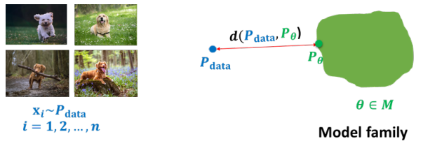

## Learning a generative mode

给定一个训练样本集（例如狗的图片），我们的目标是学习一个能够描述图像$x$的概率分布$p(x)$使得：

- **Generation （生成）**：当我们从$p(x)$中采样得到$x_\text{new}$，且$x_{\text{new}} \sim p(x)$时，$x_\text{new}$看起来应该像一只狗。
- **Density estimation（密度估计） **：当$x$看起来像狗的时候$p(x)$的概率应该比较高，否则$p(x)$的概率会比较低（可用于异常检测）。
- **Unsupervised representation learning（无监督表征学习）**：应该能学习一些共同的特征，如耳朵，尾巴等。

要满足以上的约束学习，首要问题是：如何表征$p_{\theta}(x)$，次要问题是：如何学习它

## Goal of learning

- 目标定义：学习的目标是返回一个模型$P_{\theta}$，它能精确地捕获生成我们数据的分布$P_{\text{data}}$.
- 上述目标通常是不可行的，其原因主要如下：
  - **有限数据**：只提供对真实基础分布的粗略近似。例如，假设我们用784个二元变量（黑/白像素）表示每个图像，那么可能的状态数（= 可能的图像）：$2^{784} \approx 10^{236}$，即使有$10^7$个训练样本，所覆盖的范围也非常的稀疏。
  - **计算原因**：模型复杂度限制。

- 我们希望选择$P_{\theta}$来构建$P_{\text{data}}$的"最佳"近似。但是问题是：What is ”best”?

## What is “best”?

什么是最佳，这取决于我们想做什么。

- **密度估计**：我们的目标是获得完整的分布（以便后续可以计算任意所需的条件概率）。
- **特殊的预测任务**：我们使用分布来进行预测
  - 这封电子邮件是垃圾邮件还是非垃圾邮件？
  - 结构化预测：预测视频中的下一帧，或给定图像的标题。

- **结构或知识发现**: 我们对模型本身感兴趣

  - 某些基因如何相互作用？

  - 什么导致癌症？

## Learning as density estimation

- 如果你的目标是学到一个随机变量的联合概率分布，并且让它尽量贴近产生你数据的真实分布，那你该怎么做呢？
- 在这种情境下，我们可以把学习问题看作是一个密度估计问题。也就是说，学习的目标就是去**估计数据的概率分布（概率密度函数）**。换句话说，不是只关心预测或分类结果，而是希望学到整个数据分布 $p(x)$，这样以后就能计算各种概率（比如条件概率、边缘概率等）。
- 我们的目标是构建一个参数化的分布 $P_\theta$，让它尽可能接近真实的数据分布 $P_{\text{data}}$（**通过学习参数 $\theta$，让 $P_\theta$ 与 $P_{\text{data}}$ 尽量相似。**）。注意这里假设我们只有一个数据集$\mathcal{D}$，它是从 $P_{\text{data}}$ 采样得到的。换句话说：
  - $P_{\text{data}}$ = 真实但未知的分布（我们无法直接拿到）。
  - $\mathcal{D}$ = 从 $P_{\text{data}}$ 中抽取的一批样本（就是训练数据）。
  - $P_\theta$ = 我们用模型（比如神经网络）来表示的分布，带参数 $\theta$。

- 怎么评估两个联合概率分布是否**“彼此相似”**？这里引出KL散度。

## KL-divergence

- 我们应该如何衡量两个概率分布之间的差异或相似度？

- **Kullback–Leibler (KL) 散度**是衡量两个概率分布 $p$ 和 $q$ 差异的一种方法，定义为：
  $$
  D_{\mathrm{KL}}(p \,\|\, q) = \sum_x p(x) \log \frac{p(x)}{q(x)} \quad \text{（离散情况）}
  $$
  或者连续情况：
  $$
  D_{\mathrm{KL}}(p \,\|\, q) = \int p(x) \log \frac{p(x)}{q(x)} \, dx
  $$

  - $p(x)$ ：真实分布（或者数据分布）；
  - $q(x)$ ：近似分布（或者模型分布）；
  - $\log \frac{p(x)}{q(x)}$ ：描述在 $q$ 下表示 $p$ 的信息额外开销；
  - 外层的 $p(x)$ 权重 ：表示这是在 $p$ 下的期望额外信息量；

- **Kullback–Leibler (KL) 散度性质**：

  - 非负性，$D(p \| q) \ge 0, \quad \text{当且仅当 } p = q$，**证明思路**用 **Jensen 不等式**：$\mathbb{E}[-\log X] \ge -\log \mathbb{E}[X]$。具体推导：
    $$
    \mathbb{E}_{x \sim p} \left[-\log \frac{q(x)}{p(x)}\right] 
    \ge -\log \mathbb{E}_{x \sim p}\left[\frac{q(x)}{p(x)}\right] 
    = -\log \left(\sum_x p(x) \frac{q(x)}{p(x)}\right) 
    = -\log 1 = 0
    $$

  - 

  - 非对称性，$D(p \| q) \neq D(q \| p)$，KL 散度不是“距离”，它不满足对称性。从 $p$ 到 $q$ 的信息损失 ≠ 从 $q$ 到 $p$ 的信息损失。

- **Kullback–Leibler (KL) 散度**的直观理解：它衡量了当我们真正的数据分布是 $p(x)$，但却错误地用基于 $q(x)$ 的编码方案时，平均会多花多少比特来表示数据。

  - 在信息论中，最优编码长度与分布的 **熵** 有关：
    $$
    L_p(x) = -\log_2 p(x)
    $$
    这是在知道真实分布 $p$ 的情况下，为样本 $x$ 分配的最优码长（单位：比特）。

  - 如果我们用一个错误的分布 $q$ 来编码，得到的码长是：
    $$
    L_q(x) = -\log_2 q(x)
    $$

  -  平均多出的比特数

​		当样本 $x$ 按照真实分布 $p(x)$ 产生时，平均需要的额外比特数是：
$$
\mathbb{E}_{p(x)}[L_q(x) - L_p(x)] = \sum_x p(x) \log_2 \frac{p(x)}{q(x)}
$$
​		这正是 **KL 散度**：
$$
D_{\text{KL}}(p \parallel q) = \sum_x p(x)\,\log_2 \frac{p(x)}{q(x)}.
$$

- 更通俗的解释

  - 如果你知道真实分布 $p$，你可以用最优的方式来压缩数据，平均需要 $\mathrm{H}(p)$ 个比特。

  - 但如果你不知道 $p$，而是用了错误的 $q$，那么每个样本平均会比最优情况多花 $D_{\text{KL}}(p \parallel q)$ 个比特。

  - 所以 KL 散度可以看成是 **错误假设分布 $q$ 的代价**。