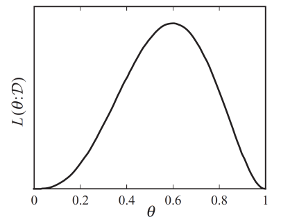

## Learning a generative mode

给定一个训练样本集（例如狗的图片），我们的目标是学习一个能够描述图像$x$的概率分布$p(x)$使得：


- **Generation （生成）**：当我们从$p(x)$中采样得到$x_\text{new}$，且$x_{\text{new}} \sim p(x)$时，$x_\text{new}$看起来应该像一只狗。
- **Density estimation（密度估计） **：当$x$看起来像狗的时候$p(x)$的概率应该比较高，否则$p(x)$的概率会比较低（可用于异常检测）。
- **Unsupervised representation learning（无监督表征学习）**：应该能学习一些共同的特征，如耳朵，尾巴等。

要满足以上的约束学习，首要问题是：如何表征$p_{\theta}(x)$，次要问题是：如何学习它

## Goal of learning

- 目标定义：学习的目标是返回一个模型$P_{\theta}$，它能精确地捕获生成我们数据的分布$P_{\text{data}}$.
- 上述目标通常是不可行的，其原因主要如下：
  - **有限数据**：只提供对真实基础分布的粗略近似。例如，假设我们用784个二元变量（黑/白像素）表示每个图像，那么可能的状态数（= 可能的图像）：$2^{784} \approx 10^{236}$，即使有$10^7$个训练样本，所覆盖的范围也非常的稀疏。
  - **计算原因**：模型复杂度限制。

- 我们希望选择$P_{\theta}$来构建$P_{\text{data}}$的"最佳"近似。但是问题是：What is ”best”?

## What is “best”?

什么是最佳，这取决于我们想做什么。

- **密度估计**：我们的目标是获得完整的分布（以便后续可以计算任意所需的条件概率）。
- **特殊的预测任务**：我们使用分布来进行预测
  - 这封电子邮件是垃圾邮件还是非垃圾邮件？
  - 结构化预测：预测视频中的下一帧，或给定图像的标题。

- **结构或知识发现**: 我们对模型本身感兴趣

  - 某些基因如何相互作用？

  - 什么导致癌症？

## Learning as density estimation

- 如果你的目标是学到一个随机变量的联合概率分布，并且让它尽量贴近产生你数据的真实分布，那你该怎么做呢？
- 在这种情境下，我们可以把学习问题看作是一个密度估计问题。也就是说，学习的目标就是去**估计数据的概率分布（概率密度函数）**。换句话说，不是只关心预测或分类结果，而是希望学到整个数据分布 $p(x)$，这样以后就能计算各种概率（比如条件概率、边缘概率等）。
- 我们的目标是构建一个参数化的分布 $P_\theta$，让它尽可能接近真实的数据分布 $P_{\text{data}}$（**通过学习参数 $\theta$，让 $P_\theta$ 与 $P_{\text{data}}$ 尽量相似。**）。注意这里假设我们只有一个数据集$\mathcal{D}$，它是从 $P_{\text{data}}$ 采样得到的。换句话说：
  - $P_{\text{data}}$ = 真实但未知的分布（我们无法直接拿到）。
  - $\mathcal{D}$ = 从 $P_{\text{data}}$ 中抽取的一批样本（就是训练数据）。
  - $P_\theta$ = 我们用模型（比如神经网络）来表示的分布，带参数 $\theta$。


- 怎么评估两个联合概率分布是否**“彼此相似”**？这里引出KL散度。

## KL-divergence

### **定义**

- 我们应该如何衡量两个概率分布之间的差异或相似度？

- **Kullback–Leibler (KL) 散度**是衡量两个概率分布 $p$ 和 $q$ 差异的一种方法，定义为：
  $$
  D_{\mathrm{KL}}(p \,\|\, q) = \sum_x p(x) \log \frac{p(x)}{q(x)} \quad \text{（离散情况）}
  $$
  或者连续情况：
  $$
  D_{\mathrm{KL}}(p \,\|\, q) = \int p(x) \log \frac{p(x)}{q(x)} \, dx
  $$

  - $p(x)$ ：真实分布（或者数据分布）；
  - $q(x)$ ：近似分布（或者模型分布）；
  - $\log \frac{p(x)}{q(x)}$ ：描述在 $q$ 下表示 $p$ 的信息额外开销；
  - 外层的 $p(x)$ 权重 ：表示这是在 $p$ 下的期望额外信息量；

------

### **性质**：

- 非负性，$D(p \| q) \ge 0, \quad \text{当且仅当 } p = q$，**证明思路**用 **Jensen 不等式**：$\mathbb{E}[-\log X] \ge -\log \mathbb{E}[X]$。具体推导：
  $$
  \mathbb{E}_{x \sim p} \left[-\log \frac{q(x)}{p(x)}\right] 
  \ge -\log \mathbb{E}_{x \sim p}\left[\frac{q(x)}{p(x)}\right] 
  = -\log \left(\sum_x p(x) \frac{q(x)}{p(x)}\right) 
  = -\log 1 = 0
  $$

- 

- 非对称性，$D(p \| q) \neq D(q \| p)$，KL 散度不是“距离”，它不满足对称性。从 $p$ 到 $q$ 的信息损失 ≠ 从 $q$ 到 $p$ 的信息损失。

------

### 直观理解：

- 它衡量了当我们真正的数据分布是 $p(x)$，但却错误地用基于 $q(x)$ 的编码方案时，平均会多花多少比特来表示数据。

- 在信息论中，最优编码长度与分布的 **熵** 有关：
  $$
  L_p(x) = -\log_2 p(x)
  $$
  这是在知道真实分布 $p$ 的情况下，为样本 $x$ 分配的最优码长（单位：比特）。

- 如果我们用一个错误的分布 $q$ 来编码，得到的码长是：

  $$
  L_q(x) = -\log_2 q(x)
  $$

- 平均多出的比特数:当样本 $x$ 按照真实分布 $p(x)$ 产生时，平均需要的额外比特数是：

$$
\mathbb{E}_{p(x)}[L_q(x) - L_p(x)] = \sum_x p(x) \log_2 \frac{p(x)}{q(x)}
$$
​        这正是 **KL 散度**：
$$
	D_{\text{KL}}(p \parallel q) = \sum_x p(x)\,\log_2 \frac{p(x)}{q(x)}.
$$

------

### 更通俗的解释

- 如果你知道真实分布 $p$，你可以用最优的方式来压缩数据，平均需要 $\mathrm{H}(p)$ 个比特。

- 但如果你不知道 $p$，而是用了错误的 $q$，那么每个样本平均会比最优情况多花 $D_{\text{KL}}(p \parallel q)$ 个比特。

- 所以 KL 散度可以看成是 **错误假设分布 $q$ 的代价**。

------

## Expected log-likelihood

### **对模型和真实分布的KL 散度展开**：

$$
D(P_{\text{data}} \| P_\theta) 
= \mathbb{E}_{x \sim P_{\text{data}}}\left[\log \frac{P_{\text{data}}(x)}{P_\theta(x)}\right]
= \mathbb{E}_{x \sim P_{\text{data}}}[\log P_{\text{data}}(x)] - \mathbb{E}_{x \sim P_{\text{data}}}[\log P_\theta(x)]
$$

- 第一项期望 $\mathbb{E}_{x \sim P_{\text{data}}}[\log P_{\text{data}}(x)]$只依赖真实分布 $P_{\text{data}}$，和模型参数 $\theta$ 无关。

- 因此，在优化时可以**忽略第一项**，优化目标就只和 $-\mathbb{E}[\log P_\theta(x)]$ 有关。

------

### **最小化 KL 散度等价于最大化期望意义下的log-likelihood**：

$$
\arg \min_\theta D(P_{\text{data}} \| P_\theta) = \arg \max_\theta \mathbb{E}_{x \sim P_{\text{data}}}[\log P_\theta(x)]
$$

- 要求模型分布 $P_\theta$ 在训练数据（即从真实分布 $P_{\text{data}}$ 中采样到的点）上给出**尽可能高的概率**，这样才能拟合真实的分布。换句话说就是：模型必须学会给‘真实世界中会发生的事件’打高分，否则就不算理解了真实世界。
- 如果某个真实数据点 $x$ 的模型概率 $P_\theta(x)$ 很小（接近 0），那么 $\log P_\theta(x)$ 就会趋向于 $-\infty$。这会导致期望的值变得非常差，从而给优化带来极大的惩罚，也就是说：**如果模型“漏掉”了某些真实数据的可能性，就会受到非常严重的惩罚。**因此，模型必须保证对所有可能出现的真实数据点分配到一定的概率质量，而不是只拟合一部分。

------

### 被忽略的项->真实分布的熵

- 根据信息论的知识，上述在优化过程中被忽略的第一项：$\mathbb{E}_{x \sim P_{\text{data}}}[\log P_{\text{data}}(x)] = - H(P_{\text{data}})$，即真实分布的熵。

- 虽然该真实分布的熵$-H(P_{\text{data}})$是个常数（不依赖 $\theta$），可以在模型比较时忽略，但我们并不知道真实分布 $P_{\text{data}}$，因此也就不知道真实的最优值。也就是说我们能用 log-likelihood 来比较模型之间的相对好坏，但因为不知道真实分布的熵 $-H(P_{\text{data}})$，无法知道模型和“最优解”之间的绝对差距。

------

### 核心问题

- 在实际情况中，我们无法直接知道真实分布 $P_{\text{data}}$，只能拿到从中采样得到的数据集。

- 所以我们用数据样本的经验分布来近似 $P_{\text{data}}$，这就是 **最大似然估计** 的由来。

------

## Maximum likelihood

### **理论期望对数似然**

- 理论期望下的对数似然被定义成如下：

$$
\mathbb{E}_{x \sim P_{data}}[\log P_\theta(x)]
$$

- 这是**在真实数据分布 $P_{data}$** 下，模型 $P_\theta$ 的对数似然的期望值。意思是：如果数据是无限多的，且确实来自真实分布，那么这是我们希望最大化的目标。

------

### **经验近似（empirical approximation）**

- 通常因为我们没有真实分布 $P_{data}$，只能从有限的数据集$\mathcal{D}$中近似。所以用 **训练数据集上的平均对数似然** 来近似期望（依据蒙特卡洛采样，后面会介绍）。

$$
\mathbb{E}_\mathcal{D} [\log P_\theta(x)] = \frac{1}{|\mathcal{D}|} \sum_{x \in \mathcal{D}} \log P_\theta(x)
$$

------

### **最大似然学习（MLE）**

- 学习目标就是找到参数 $\theta$，让模型在训练数据上的平均对数似然最大。等价于 **最小化交叉熵**，也等价于 **最小化 KL 散度 $D_{KL}(P_{data} \parallel P_\theta)$**。

$$
\max_{P_\theta} \frac{1}{|\mathcal{D}|} \sum_{x \in \mathcal{D}} \log P_\theta(x)
$$

------

### **等价形式：最大化联合似然**

$$
P_\theta(x^{(1)}, \cdots, x^{(m)}) = \prod_{x \in \mathcal{D}} P_\theta(x)
$$

- 因为训练样本 $x^{(1)}, \ldots, x^{(m)}$ 是独立同分布 (i.i.d.) 的，所以联合概率等于所有样本概率的乘积。对数化后就变成了前面求和的形式。

------

## Main idea in Monte Carlo Estimation

### 把关心的量表示为某个随机变量的期望值。

- 假设你关心的量是：

$$
\mathbb{E}_{x\sim P}[g(x)] = \sum_x g(x)P(x)
$$

- （或连续情形下为积分）。这是一个确定的数（取决于 $P$ 与 $g$），但通常无法解析求和/积分或 $P$ 不显式给出，于是用采样近似。

------

### 用样本构造估计量 $\hat g$

- 从分布 $P$ 独立同分布（i.i.d.）采 $T$ 个样本 $x_1,\dots,x_T$，构造估计量：

$$
\hat g(x_1,\dots,x_T)\;=\;\frac{1}{T}\sum_{t=1}^T g(x_t).
$$

- 注意这里把 $\hat g$ 写作样本 $x_1,\dots,x_T$ 的函数 — 它**依赖于随机样本**。

------

### 为什么 $\hat g$ 是随机变量？

- 样本 $x_1,\dots,x_T$ 是随机的（由分布 $P$ 生成）。
- $\hat g$ 是这些随机样本通过确定性映射（求和并除以 $T$）得到的数值。因此 $\hat g$ 本身是一个随机变量：不同的样本集通常会产生不同的 $\hat g$ 值。
- 通俗地说：把同一枚硬币投 $T$ 次算“正面频率”，这个频率就是个随机变量 — 不同的投掷结果会给不同的频率值。这里的 $\hat g$ 就类似。

------

## Properties of the Monte Carlo Estimate

### **$\hat g$的统计性质->无偏性（unbiased）**

- 因为样本独立且同分布，因此 $\hat g$ 是 $ \mathbb{E}[g(x)]$ 的无偏估计量。

$$
\mathbb{E}[\hat g] = \mathbb{E}\!\left[\frac{1}{T}\sum_{t=1}^T g(x_t)\right]
= \frac{1}{T}\sum_{t=1}^T \mathbb{E}[g(x_t)]
= \mathbb{E}_{x\sim P}[g(x)].
$$

### **$\hat g$的统计性质->一致性 / 大数定律**：

- 由大数定律（law of large numbers），当 $T\to\infty$ 时：

$$
\hat g = \frac{1}{T}\sum_{t=1}^T g(x_t) \xrightarrow{\text{a.s.}} \mathbb{E}[g(x)].
$$

- 也就是说当 $T\to\infty$ 时估计量几乎必然收敛到真实期望（只要 $g$ 的期望存在）。

### **$\hat g$的统计性质->方差（误差规模）**

- （若 $\operatorname{Var}(g(x))<\infty$）利用独立性有：

$$
\operatorname{Var}(\hat g)
= \frac{1}{T^2}\sum_{t=1}^T \operatorname{Var}(g(x_t))
= \frac{1}{T}\operatorname{Var}_{x\sim P}(g(x)).
$$

- 所以方差随着样本数 $T$ 以 $1/T$ 速率下降。估计量的标准误（standard error）为 $\sqrt{\operatorname{Var}(g)/T}$。

### **$\hat g$的统计性质->渐近正态性（中心极限定理）**

- 若 $\operatorname{Var}(g(x))<\infty$，则当 $T$ 大时

$$
\sqrt{T}\,(\hat g - \mathbb{E}[g]) \ \overset{d}{\longrightarrow}\ \mathcal{N}\big(0,\operatorname{Var}(g)\big).
$$

- 这给出构建近似置信区间的方法。

------

## Example

单变量示例：一个有偏硬币

- 两种可能结果：正面 (H) 和反面 (T)
- 数据集：对该有偏硬币的多次投掷，例如：

$$
D = \{H, H, T, H, T\}
$$

- 假设：投硬币的过程由一个概率分布 $P_{\text{data}}(x)$ 控制，其中 $x \in \{H, T\}$。

- 模型集合 $M$：所有定义在 $\{H,T\}$ 上的概率分布。（即所有可能的“抛硬币概率模型”，由 $P(H)=p, P(T)=1-p$ 表示。）

- 学习任务示例：如果在数据集 $D$ 中，5 次投掷里有 3 次是正面，那么我们该如何从模型集合 $M$ 中选择一个分布 $P_\theta(x)$？

## MLE scoring for the coin example

### 模型表示

- 模型定义：

$$
P_\theta(x=H) = \theta, \quad P_\theta(x=T) = 1-\theta
$$

- θ 是硬币正面出现的概率，1−θ 是硬币反面出现的概率。
- 这个模型族就是**伯努利分布**，θ ∈ [0,1]。

------

### 数据样本集

- 给出的数据样本集合如下：

$$
\mathcal{D} = \{H, H, T, H, T\}
$$

- 总共 5 次投掷。
- 正面 H 出现次数：3
- 反面 T 出现次数：2

------

### 数据的似然函数（Likelihood）

- 对于独立同分布（i.i.d.）样本 $x_1,\dots,x_5$，似然函数定义为：

$$
L(\theta) = P_\theta(\mathcal{D}) = \prod_{i=1}^5 P_\theta(x_i)
$$

- 代入数据：

$$
L(\theta) = P_\theta(H) \cdot P_\theta(H) \cdot P_\theta(T) \cdot P_\theta(H) \cdot P_\theta(T)
= \theta \cdot \theta \cdot (1-\theta) \cdot \theta \cdot (1-\theta)
= \theta^3 (1-\theta)^2
$$




------

### 最大似然估计（MLE）

- 最大似然估计要求：

$$
\hat\theta = \arg\max_\theta L(\theta)
$$

- 通常对伯努利分布，取对数似然会更方便：

$$
\ell(\theta) = \log L(\theta) = 3 \log \theta + 2 \log(1-\theta)
$$

------

### 求解 θ

- 对 θ 求导数并令导数为 0：

$$
\frac{d\ell}{d\theta} = \frac{3}{\theta} - \frac{2}{1-\theta} = 0
$$

- 解方程：

$$
\frac{3}{\theta} = \frac{2}{1-\theta} \quad \Rightarrow \quad 3(1-\theta) = 2\theta
$$

- 这就是所谓的**闭式解（closed-form solution）**：不需要迭代或数值优化，直接用代数求出 θ。

------

## Extending the MLE principle to autoregressive models

### 自回归模型的定义

- 给定一个**n 维变量** $(x_1, x_2, \dots, x_n)$ 的自回归模型：

$$
P_\theta(x) = \prod_{i=1}^{n} p_{\text{neural}}(x_i \mid x_{<i}; \theta_i)
$$

- 这里$x_{<i} = (x_1, x_2, \dots, x_{n-1)}$
- 每个条件概率$p_{\text{neural}}(x_i \mid x_{<i}; \theta_i)$由一个神经网络（或更一般的可微函数）表示。
- 参数集合：$\theta = (\theta_1, \dots, \theta_n)$，每个 θ_i 控制对应条件概率。

- **直观理解**：自回归模型把联合概率分布拆成一连串条件概率，然后用神经网络来建模每个条件概率。

------

### 训练数据

- 训练数据集：

$$
\mathcal{D} = \{x^{(1)}, x^{(2)}, \dots, x^{(m)}\}
$$

- 每个样本 $x^{(j)}$ 是 n 维向量。
- 我们希望通过最大化训练数据的似然来学习 θ。

------

### 最大似然函数

- 联合似然函数定义为：

$$
L(\theta, D) = \prod_{j=1}^{m} P_\theta(x^{(j)}) 
= \prod_{j=1}^{m} \prod_{i=1}^{n} p_{\text{neural}}(x_i^{(j)} \mid x_{<i}^{(j)}; \theta_i)
$$

- 对应对数似然函数为：

$$
\ell(\theta) = \log L(\theta,D) = \sum_{j=1}^{m} \sum_{i=1}^{n} \log p_{\text{neural}}(x_i^{(j)} \mid x_{<i}^{(j)}; \theta_i)
$$

- 对数似然方便求梯度和优化。

------

### 最大似然估计目标

$$
\hat\theta = \arg\max_\theta \ell(\theta)
= \arg\max_\theta \sum_{j=1}^{m} \sum_{i=1}^{n} \log p_{\text{neural}}(x_i^{(j)} \mid x_{<i}^{(j)}; \theta_i)
$$

- 我们希望找到一组 θ，使得所有训练样本出现的概率最大。
- 这就是自回归模型下的最大似然估计（MLE）。

------

### 为什么不再有闭式解

- 每个条件概率 $p_{\text{neural}}(x_i \mid x_{<i}; \theta_i)$ 是由神经网络建模的。

- 神经网络一般是非线性、复杂的函数（例如多层激活函数）。

- 对这种复杂函数的对数似然求导方程，无法用简单代数直接求解 θ。

- 因此不再有类似伯努利分布那样的“闭式解” $\hat\theta = \frac{\#H}{\text{总次数}}$。

- **解决方案**：采用**数值优化**方法（gradient ascent / SGD / Adam）迭代更新参数 θ；每次迭代计算对数似然的梯度，然后更新 θ 直到收敛。

------

### 总结

- 对自回归模型，MLE 的目标是最大化训练数据的对数似然。
- 由于条件概率是神经网络表示，似然函数复杂，**无法解析求解 θ**。
- 所以需要使用梯度优化方法迭代求解。

------

## MLE Learning: Batch Gradient Descent

本节解释“批量梯度下降（Batch Gradient Descent）”在 MLE 下的训练流程：每次迭代用“全数据集”计算精确梯度再更新参数。

### 问题设定与自回归分解

- 数据集：$\mathcal D=\{x^{(1)},\dots,x^{(m)}\}$，每个样本是长度为 $n$ 的序列 $x=(x_1,\dots,x_n)$。
- 模型：用参数为 $\theta$ 的神经网络定义联合分布 $P_\theta(x)$。常见地，采用自回归分解：
  $$
  P_\theta(x)=\prod_{i=1}^n p_{\text{neural}}\big(x_i\mid x_{<i};\theta_i\big).
  $$
  实践中经常共享一套参数（如 Transformer/RNN），此处写成 $\theta_i$ 只是强调每个条件项都由参数控制。

### 极大似然与对数似然

- 训练目标是最大化训练集的联合似然：
  $$
  L(\theta,\mathcal D)=\prod_{j=1}^m P_\theta\big(x^{(j)}\big)=\prod_{j=1}^m\prod_{i=1}^n p_{\text{neural}}\big(x_i^{(j)}\mid x^{(j)}_{<i};\theta_i\big).
  $$
- 为了数值稳定与便于求导，最大化对数似然（乘法变加法）：
  $$
  \ell(\theta)=\log L(\theta,\mathcal D)=\sum_{j=1}^m\sum_{i=1}^n \log p_{\text{neural}}\big(x_i^{(j)}\mid x^{(j)}_{<i};\theta_i\big).
  $$
- 在深度学习实现里，通常最小化负对数似然（NLL），也就是交叉熵损失：
  $$
  J(\theta)=-\ell(\theta)=-\sum_{j,i}\log p_\theta\big(x_i^{(j)}\mid x^{(j)}_{<i}\big).
  $$

### 基于梯度的方法（反向传播）

由于 $p_{\text{neural}}$ 由神经网络给出，目标函数非凸、不可解析求解，采用数值优化：

1. 随机初始化参数 $\theta^0$。
2. 用反向传播计算梯度 $\nabla_\theta \ell(\theta)$（或 $\nabla_\theta J(\theta)$）。
3. 参数更新：
   - 最大化对数似然（梯度上升）：$\;\theta^{t+1}=\theta^t+\alpha_t\,\nabla_\theta\ell(\theta^t)$；
   - 等价地，最小化 NLL（梯度下降）：$\;\theta^{t+1}=\theta^t-\alpha_t\,\nabla_\theta J(\theta^t)$。

全数据版本（本节）：每次迭代在整个训练集上累积梯度（或等价地对平均 NLL 求梯度），更新一次参数。优点是梯度精确且无噪声；缺点是对大数据集计算/显存开销很大，通常仅在小数据或分析场景使用，或配合二阶/线搜索方法。

### 训练伪代码（全数据梯度）

```text
given dataset D, model p_theta(x_i | x_<i)
initialize theta
repeat until convergence:
  # full-batch loss over all data
  J(theta) = - sum_{x in D} sum_i log p_theta(x_i | x_<i)
  g = dJ/dtheta  # backprop over full dataset (or average loss)
  theta <- optimizer_update(theta, g)
```

### 与常见损失的对应

- 二分类：$p_\theta(x=1)=\sigma(f_\theta)$，NLL 即二元交叉熵。
- 多分类/语言模型：每个位置的 $-\log p_\theta(x_i\mid x_{<i})$ 等价于交叉熵(one-hot, softmax)。

### 实践要点（适用于全/小批量，但本节强调全数据场景）

- 学习率与调度：AdamW + 预热/余弦衰减常见且稳健。
- 数值稳定：使用稳定实现的 log-softmax/交叉熵，避免下溢。
- 正则化与泛化：权重衰减、dropout、早停；必要时 label smoothing。
- 序列训练细节：teacher forcing；长序列可用梯度裁剪，合适的归一化与架构。

一句话总结：通过自回归分解把联合分布写成条件概率乘积；用极大似然在训练数据上最大化对数概率；使用“全数据（Batch）梯度”进行每步更新，梯度精确但计算代价高。

## MLE Learning: Stochastic Gradient Descent

差异速览（与上节 Batch GD 对比）：
- 计算粒度：SGD 使用单样本或 mini-batch 的随机梯度近似全数据梯度；Batch GD 使用全数据精确梯度。
- 计算代价：SGD 每步更便宜，可更快迭代，适合大数据；Batch GD 每步昂贵但无噪声。
- 噪声与收敛：SGD 梯度含噪声，收敛轨迹抖动但有助逃离鞍点；Batch GD 轨迹平滑但可能卡在鞍点/差的盆地。
- 学习率与调度：SGD 常配合较小学习率、动量/AdamW、预热与衰减；Batch GD 常与线搜索/精细步长更搭。

### 目标回顾与基本步骤

- 对数似然：
  $$
  \ell(\theta)=\log L(\theta,\mathcal D)=\sum_{j=1}^m\sum_{i=1}^n \log p_{\text{neural}}\big(x_i^{(j)}\mid x^{(j)}_{<i};\theta_i\big).
  $$
- 训练三步：
  1) 随机初始化 $\theta^0$；
  2) 由反向传播计算梯度 $\nabla_\theta\ell(\theta)$；
  3) 更新（上升最大化或下降最小化 NLL）：$\theta^{t+1}=\theta^t+\alpha_t\,\nabla_\theta\ell(\theta^t)$。

### 对单个参数块的梯度（无参数共享）

若每个条件分布拥有各自独立的参数 $\theta_i$，则：
$$
\nabla_{\theta_i}\,\ell(\theta)
= \sum_{j=1}^m \nabla_{\theta_i} \log p_{\text{neural}}\big(x_i^{(j)}\mid x^{(j)}_{<i};\theta_i\big),
$$
即 $\theta_i$ 只与索引为 $i$ 的项相关联，其它 $k\ne i$ 的项不贡献梯度。

> 启示：若完全不共享参数，每个条件项可“各自为政”地优化。然而，实际的自回归模型（NADE、PixelRNN、PixelCNN、Transformer LM 等）通常共享一套参数：$\theta_i\equiv\theta$。

### 共享参数时的梯度

当所有位置共享参数 $\theta$ 时：
$$
\nabla_{\theta}\,\ell(\theta)=\sum_{j=1}^m\sum_{i=1}^n \nabla_{\theta} \log p_{\text{neural}}\big(x_i^{(j)}\mid x^{(j)}_{<i};\theta\big),
$$
这就是我们用反向传播从所有样本、所有位置累计得到的梯度。

### 大数据集情形与蒙特卡洛近似

当 $m=|\mathcal D|$ 很大时，直接对全部数据求和代价高。把上式改写为期望形式（以“求和的平均”替代）：
$$
\nabla_{\theta}\,\ell(\theta)
= m\,\underbrace{\Bigg(\frac{1}{m}\sum_{j=1}^m \sum_{i=1}^n \nabla_{\theta}\log p_{\text{neural}}(x_i^{(j)}\mid x^{(j)}_{<i};\theta)\Bigg)}_{\;\;\mathbb{E}_{x^{(j)}\sim\mathcal D}\,[\sum_i \nabla_{\theta}\log p_{\text{neural}}(x_i\mid x_{<i};\theta)]}
\;=\; m\,\mathbb{E}_{x\sim\mathcal D}\bigg[\sum_{i=1}^n \nabla_{\theta}\log p_{\text{neural}}(x_i\mid x_{<i};\theta)\bigg].
$$

于是可用蒙特卡洛估计该期望：
- 单样本估计：
  $$
  \nabla_{\theta}\,\ell(\theta)
  \approx m\,\sum_{i=1}^n \nabla_{\theta}\log p_{\text{neural}}\big(x_i^{(j)}\mid x^{(j)}_{<i};\theta\big),\quad x^{(j)}\sim\mathcal D.
  $$
- mini-batch 估计（实践默认，方差更小）：取批大小为 $b$ 的索引集合 $B$，
  $$
  \nabla_{\theta}\,\ell(\theta)
  \approx \frac{m}{b}\sum_{j\in B}\sum_{i=1}^n \nabla_{\theta}\log p_{\text{neural}}\big(x_i^{(j)}\mid x^{(j)}_{<i};\theta\big).
  $$

> 备注：很多实现直接优化“平均 NLL”（把上式除以 $m$），这会把前面的 $m$ 消掉，使得估计器变为对 batch 的简单平均。两种记法等价，差别被学习率吸收。

### 统计性质与实践要点

- 无偏性：mini-batch 梯度是全数据梯度的无偏估计；批越大，方差越小（近似 $\propto 1/b$）。
- 标度与实现：注意 sum vs. mean 的约定，避免与学习率、梯度累积混淆。
- 训练细节：打乱数据、合适的 batch size、梯度裁剪、混合精度与梯度累积都可稳定并提速训练。

### mini-batch SGD 伪代码（共享参数）

```text
given dataset D, shared-parameter model p_theta
initialize theta
repeat until convergence:
    sample a mini-batch B = {x^(j)}_{j=1..b}
    J(theta) = - (1/b) * sum_{x in B} sum_{i=1}^n log p_theta(x_i | x_<i)
    g = dJ/dtheta  # backprop
    theta <- optimizer_update(theta, g)
```

小结：SGD/mini-batch 的本质是用蒙特卡洛近似“全数据对数似然梯度”的期望；当参数共享时，所有位置/样本的梯度会在反向传播中自然累加到同一套参数上。

